# Web HR — AvA Group

> **Sistem Manajemen SDM & Payroll berbasis web** untuk AvA Group (AVA Sportivo, Ayres Apparel, JNE, Toko Solo).
> Presensi digital (selfie + GPS), penjadwalan shift, lembur berjenjang, pinjaman, dan mesin payroll otomatis lengkap dengan slip gaji.

**Versi Dokumen:** 3.0 · **Zona waktu sistem:** Asia/Jakarta (WIB) · **Bahasa:** Indonesia

Dokumen ini berisi **dua bagian**:
- **Bagian A — Dokumentasi Teknis**: arsitektur, model data, alur (flow diagram), modul, API, setup & deployment.
- **Bagian B — Panduan Pengguna**: alur pemakaian per peran (Karyawan, SPV/Manager, Admin) dan aturan sistem.

---

## Daftar Isi

**Bagian A — Teknis**
1. [Gambaran Umum](#1-gambaran-umum)
2. [Tech Stack](#2-tech-stack)
3. [Arsitektur Sistem](#3-arsitektur-sistem)
4. [Struktur Direktori](#4-struktur-direktori) · [4.1 Sitemap Lengkap](#41-peta-halaman-sitemap-lengkap)
5. [Autentikasi & Sesi](#5-autentikasi--sesi)
6. [Model Data (ERD & Katalog Tabel)](#6-model-data-erd--katalog-tabel)
7. [Alur Utama / Flow Diagram](#7-alur-utama--flow-diagram)
   - [7.1 Login & Routing Peran](#71-login--routing-peran)
   - [7.1a Registrasi & Lengkapi Data Diri](#71a-registrasi--lengkapi-data-diri)
   - [7.2 Presensi Masuk / Pulang (+ Blokir/Pulihkan)](#72-presensi-masuk--pulang)
   - [7.3 Lembur & Approval Berjenjang](#73-lembur--approval-berjenjang)
   - [7.4 Pinjaman (Lifecycle)](#74-pinjaman-lifecycle)
   - [7.5 Pipeline Payroll](#75-pipeline-payroll)
   - [7.6 Payroll Freelance](#76-payroll-freelance)
   - [7.7 Slip Gaji & Distribusi](#77-slip-gaji--distribusi)
8. [Modul Bisnis (`lib/`)](#8-modul-bisnis-lib)
9. [Peta API Endpoint](#9-peta-api-endpoint)
10. [Setup & Menjalankan](#10-setup--menjalankan)
11. [Environment Variables](#11-environment-variables)
12. [Deployment](#12-deployment)
13. [Catatan Keamanan & Teknis](#13-catatan-keamanan--teknis)

**Bagian B — Panduan Pengguna**
14. [Peran & Hak Akses](#14-peran--hak-akses)
15. [Alur Karyawan](#15-alur-karyawan)
16. [Alur Supervisor & Manager](#16-alur-supervisor--manager)
17. [Alur Admin](#17-alur-admin)
18. [Aturan Sistem](#18-aturan-sistem)
19. [Kode Status Presensi](#19-kode-status-presensi)
20. [FAQ](#20-faq)

---

# BAGIAN A — DOKUMENTASI TEKNIS

## 1. Gambaran Umum

Web HR AvA Group adalah aplikasi **full-stack Next.js (App Router)** yang menyatukan seluruh proses HR ke dalam satu platform:

| Domain | Kemampuan |
|--------|-----------|
| **Presensi** | Check-in / check-out berbasis **selfie + GPS geofence**, deteksi shift & keterlambatan otomatis |
| **Penjadwalan** | Set jadwal shift per karyawan per hari (SPV/Manager/Admin) |
| **Lembur** | Pengajuan + approval **1x atau 2x berjenjang** (atasan → admin) |
| **Pinjaman** | Pengajuan mandiri, cicilan otomatis terpotong payroll, pelunasan awal |
| **Payroll** | Mesin perhitungan gaji **real-time** dari absensi + lembur + potongan + omzet |
| **Payroll khusus** | Solo, Penjahit (mingguan/bulanan), Sales Nasional, Freelance (jam/pengerjaan/harian/custom) |
| **Slip** | Slip gaji & slip bonus (PDF), distribusi ke akun karyawan |
| **Keuangan** | Rekap finance per unit, kontrak, reimburse, perjalanan dinas |
| **Lainnya** | Laporan kunjungan sales, HR Agent (AI tanya-jawab data), export Excel/PDF |

Semua pencatatan waktu memakai **Asia/Jakarta (WIB)**. Periode payroll berjalan dari **tanggal 26 bulan sebelumnya s.d. tanggal 25 bulan berjalan**.

---

## 2. Tech Stack

| Lapisan | Teknologi |
|---------|-----------|
| **Framework** | Next.js `16.1.6` (App Router, React Server Components + Route Handlers) |
| **UI** | React `19.2.3`, Tailwind CSS `v4`, TypeScript `5` |
| **Database** | MySQL (via `mysql2` connection pool, `namedPlaceholders`) |
| **Auth** | Cookie sesi HMAC-SHA256 (httpOnly), password SHA2-256, Bearer token untuk mobile |
| **Export** | `exceljs` (Excel), `jspdf` + `jspdf-autotable` (PDF) |
| **Visual login** | `three.js` + `postprocessing` (animasi GridScan, desktop only) |
| **AI (HR Agent)** | Ollama Cloud (`gpt-oss:120b-cloud`) via `OLLAMA_HOST` — tool-calling read-only ke DB |
| **Runtime** | Node.js |

> Path alias `@/*` → root project (lihat `tsconfig.json`). Tidak ada ORM — query SQL langsung lewat `lib/db.ts` (pool tunggal, cached global saat dev).

---

## 3. Arsitektur Sistem

Aplikasi memakai arsitektur **berlapis** khas Next.js App Router: halaman (Server Components) dan Route Handlers memanggil **lapisan modul bisnis** di `lib/`, yang menjadi satu-satunya jalur ke database.

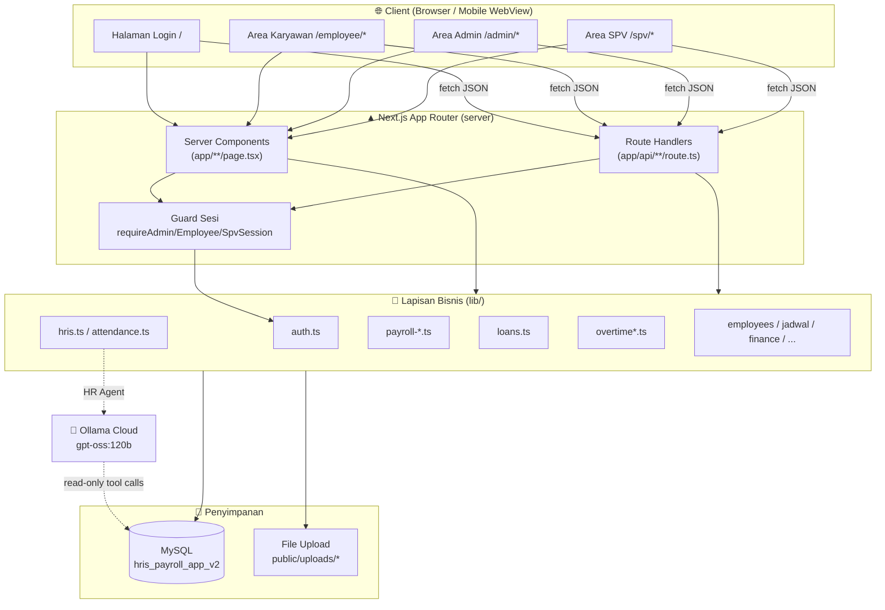

**Prinsip kunci:**

- **Tanpa middleware global** — proteksi dilakukan per-halaman/route lewat `requireAdminSession()`, `requireEmployeeSession()`, `requireSpvSession()` yang `redirect("/")` bila sesi tidak valid.
- **Migrasi lazy & idempotent** — setiap modul punya `ensureXxxSchemaSupport()` (singleton promise) yang menjalankan `CREATE TABLE IF NOT EXISTS` / `ALTER` saat pertama diakses, dibungkus `safeMigrate` yang menelan error "sudah ada" (`ER_TABLE_EXISTS_ERROR`, `ER_DUP_FIELDNAME`, dll). Schema bisa berevolusi tanpa migrasi manual.
- **Upload** — file (selfie, KTP, bukti) disimpan di `public/uploads/` dan disajikan via rewrite `/uploads/:path*` → `/api/uploads/[...path]`.
- **Real-time payroll** — tidak ada job batch; summary payroll dihitung on-the-fly dari data absensi/lembur terbaru setiap halaman dibuka.

---

## 4. Struktur Direktori

```
web_hr/
├── app/                          # Next.js App Router
│   ├── page.tsx                  # Halaman login/signup (entry)
│   ├── layout.tsx, error.tsx     # Root layout & error boundary
│   ├── employee/                 # 14 halaman area karyawan
│   │   ├── check-in / check-out  # Presensi
│   │   ├── overtime / loans      # Lembur & pinjaman
│   │   ├── payslips / bonus-slips# Slip
│   │   └── ...                   # jadwal, contract, profile, visit-report, dll
│   ├── admin/                    # 20+ halaman area admin (lihat sidebar)
│   │   ├── employees, attendance, jadwal, overtime, loans
│   │   ├── payroll-summary/{solo,penjahit,sales-nasional}
│   │   ├── payroll-bonus, payroll-freelance
│   │   ├── payslips, payslip-distribution, bonus-slips, ...
│   │   └── finance, contract-*, reimbursements, roles, hr-agent
│   ├── spv/                      # Area SPV (jadwal + approval lembur)
│   └── api/                      # Route Handlers (REST-ish)
│       ├── login, logout, signup, mobile/login
│       ├── employee/*            # Endpoint karyawan
│       ├── admin/*               # Endpoint admin
│       ├── spv/*                 # Endpoint SPV
│       └── uploads/[...path]     # Serve file upload
├── components/                   # 42 komponen React (Admin*, Employee*, Spv*, Shell, dll)
├── lib/                          # 35 modul bisnis (business logic + akses DB)
├── database/ , db/               # Skrip SQL (schema & seed)
│   └── db/hris_payroll_app_v2.sql# Schema kanonik (nama DB default)
├── scripts/seed-admins.mjs       # Seeder akun admin
├── public/                       # Aset statis + uploads/
├── next.config.ts                # Rewrite /uploads
└── package.json
```

### 4.1 Peta Halaman (Sitemap Lengkap)

**Publik**
| Route | Fungsi |
|-------|--------|
| `/` | Login + Sign Up (entry, animasi GridScan) |

**Karyawan** (`/employee/*`)
| Route | Fungsi |
|-------|--------|
| `/employee` | Dashboard karyawan (ringkasan absensi, lembur, pinjaman, slip) |
| `/employee/check-in` | Presensi masuk (selfie + GPS) |
| `/employee/check-out` | Presensi pulang |
| `/employee/attendance-history` | Riwayat absensi pribadi |
| `/employee/overtime` | Ajukan & riwayat lembur |
| `/employee/overtime-approvals` | Approval lembur (untuk SPV/Manager yang login sbagai karyawan) |
| `/employee/jadwal` | Setup jadwal (untuk SPV/Manager/scheduler whitelist) |
| `/employee/loans` | Ajukan & pantau pinjaman |
| `/employee/payslips` | Slip gaji |
| `/employee/bonus-slips` | Slip bonus |
| `/employee/reimbursements` | Ajukan reimburse |
| `/employee/business-trips` | Ajukan perjalanan dinas |
| `/employee/contract` | Informasi kontrak & riwayat potongan |
| `/employee/visit-report` | Laporan kunjungan (sales) |
| `/employee/profile` | Lengkapi/edit data diri (NIK, KTP, bank, dll) |

**SPV** (`/spv/*`)
| Route | Fungsi |
|-------|--------|
| `/spv` | Redirect → `/spv/jadwal` |
| `/spv/jadwal` | Set jadwal shift tim |
| `/spv/overtime-approvals` | Approval lembur tim |

**Admin** (`/admin/*`)
| Route | Fungsi |
|-------|--------|
| `/admin` | Dashboard admin (statistik karyawan/presensi/payroll/slip) |
| `/admin/employees` | Data karyawan |
| `/admin/attendance` | Rekap absensi + koreksi kode + libur nasional + pulihkan |
| `/admin/jadwal` | Set jadwal semua karyawan |
| `/admin/overtime` | Approval lembur |
| `/admin/visit-reports` | Laporan kunjungan sales |
| `/admin/business-trips` | Approval perjalanan dinas |
| `/admin/reimbursements` | Approval reimburse |
| `/admin/payroll-summary` | Summary payroll utama |
| `/admin/payroll-summary/solo` | Payroll Toko Solo |
| `/admin/payroll-summary/penjahit` | Payroll penjahit |
| `/admin/payroll-summary/sales-nasional` | Payroll Sales Nasional |
| `/admin/payroll-bonus` | Payroll bonus |
| `/admin/payroll-freelance` | Payroll freelance (4 tipe) |
| `/admin/payslips` | Slip gaji |
| `/admin/payslip-distribution` | Distribusi slip gaji |
| `/admin/bonus-slips` | Slip bonus |
| `/admin/bonus-slip-distribution` | Distribusi slip bonus |
| `/admin/finance` | Rekap keuangan per unit |
| `/admin/loans` | Manajemen pinjaman |
| `/admin/contract-deductions` | Potongan kontrak |
| `/admin/contract-returns` | Pengembalian kontrak |
| `/admin/roles` | Kelola akun Admin & SPV |
| `/admin/hr-agent` | HR Agent (AI) |

---

## 5. Autentikasi & Sesi

### Mekanisme

- **Password** disimpan sebagai hash **SHA2-256** (dihitung di MySQL via `SHA2(?, 256)`). Login membandingkan hash input dengan kolom `users.password`.
- **Sesi** = token `base64url(payload).HMAC-SHA256(payload)` ditandatangani dengan `APP_SESSION_SECRET`. Disimpan di **cookie httpOnly** (`sameSite=lax`, `secure` di production, `maxAge` 8 jam).
- **Tiga cookie sesi terpisah**: `web_hr_admin_session`, `web_hr_employee_session`, `web_hr_spv_session`.
- **Mobile**: token sama dikirim via header `Authorization: Bearer <token>` (dengan klaim `exp`). Cookie web tidak memakai `exp` (masa berlaku diatur `maxAge`).
- **Verifikasi tanda tangan** memakai `timingSafeEqual` (anti timing-attack).

### Hak akses berbutir (fine-grained)

Selain peran, ada **whitelist email** di `lib/auth.ts` untuk aksi sensitif:

| Fungsi | Arti |
|--------|------|
| `isPayrollEditor(email)` | Hanya email tertentu boleh **edit/simpan** Summary Payroll; admin lain read-only |
| `isOvertimeApprover(email)` | Hanya email tertentu boleh **approve/reject** lembur; admin lain read-only |

> ⚠️ **Catatan keamanan**: jika `APP_SESSION_SECRET` tidak di-set di production, sistem memakai default tidak aman (hanya memicu `console.warn`, tidak throw). **Wajib set env var ini di server.**

---

## 6. Model Data (ERD & Katalog Tabel)

### ERD inti

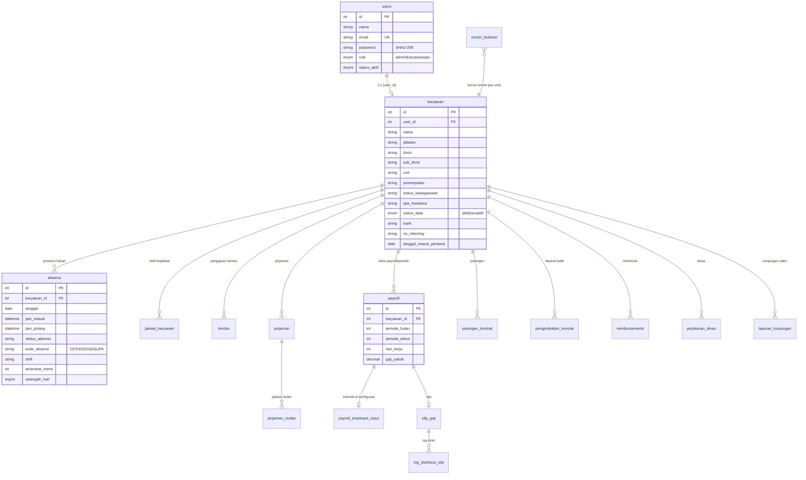

### Katalog tabel

Skema kanonik ada di **`db/hris_payroll_app_v2.sql`**; sebagian tabel juga dibuat lazy via `ensureXxxSchemaSupport()` di `lib/`.

| Kelompok | Tabel |
|----------|-------|
| **Akun & karyawan** | `users`, `karyawan`, `otp_codes` |
| **Presensi & jadwal** | `absensi`, `jadwal_karyawan`, `libur_nasional` |
| **Lembur** | `lembur` |
| **Payroll inti** | `payroll`, `payroll_employee_input`, `payroll_period_config`, `omzet_bulanan`, `payroll_bonus` |
| **Freelance** | `freelance_jam`, `freelance_pengerjaan`, `freelance_harian`, `freelance_custom_item`, `freelance_custom_pengerjaan` |
| **Pinjaman** | `pinjaman`, `pinjaman_cicilan` |
| **Kontrak** | `potongan_kontrak`, `pengembalian_kontrak` |
| **Slip** | `slip_gaji`, `slip_bonus`, `log_distribusi_slip`, `log_distribusi_slip_bonus` |
| **Keuangan lain** | `finance_lembur_tambahan`, `reimbursements`, `perjalanan_dinas` |
| **Sales** | `laporan_kunjungan` |
| **Sistem** | `app_migrations`, `hris_migration_log` |

**Kolom penting `karyawan`** yang mengendalikan banyak logika:
- `jabatan` → menentukan sales/penjahit/freelance/CEO (mis. `getFreelanceSheet` menyaring `jabatan='freelance'`).
- `status_kepegawaian` → `tetap`/`freelance`/dll (memengaruhi tunjangan & waive kontrak).
- `penempatan` → geofence & pemisahan halaman (Toko Solo terpisah).
- `sub_divisi` → penjahit/media/dll (shift & kelas payroll).
- `unit` → kelompok omzet (AVA/Ayres/JNE).
- `status_data` → `aktif`/`nonaktif` (nonaktif hilang dari payroll periode berikutnya).

---

## 7. Alur Utama / Flow Diagram

### 7.1 Login & Routing Peran

Satu endpoint `/api/login` memvalidasi kredensial lalu mengarahkan sesuai `users.role`.

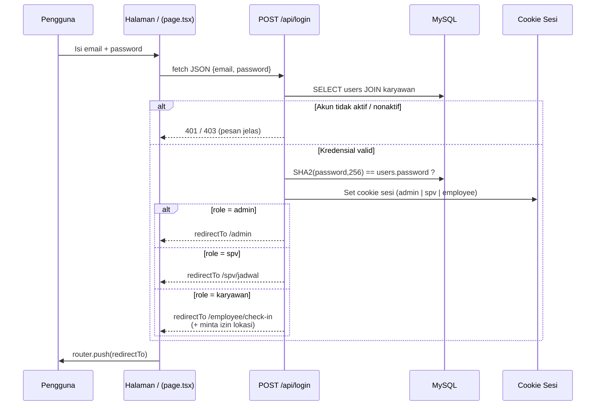

> Karyawan juga diminta **izin lokasi GPS** saat login (disimpan sementara di `sessionStorage`) agar presensi lancar. Pada tanggal 1 (payday) muncul salam payroll.
>
> **Mobile**: `POST /api/mobile/login` mengembalikan **Bearer token** (signed-session identik cookie web, dengan klaim `exp`) khusus role `karyawan` untuk dipakai aplikasi mobile via header `Authorization`.

### 7.1a Registrasi & Lengkapi Data Diri

Karyawan baru mendaftar sendiri, lalu melengkapi profil (NIK, KTP, bank, dll) sebelum data dipakai payroll.

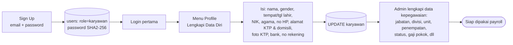

> NIK unik (duplikat ditolak). Foto KTP diunggah ke `public/uploads/ktp/`. Field kepegawaian (jabatan/divisi/gaji) hanya bisa diisi Admin di menu Data Karyawan.

### 7.2 Presensi Masuk / Pulang

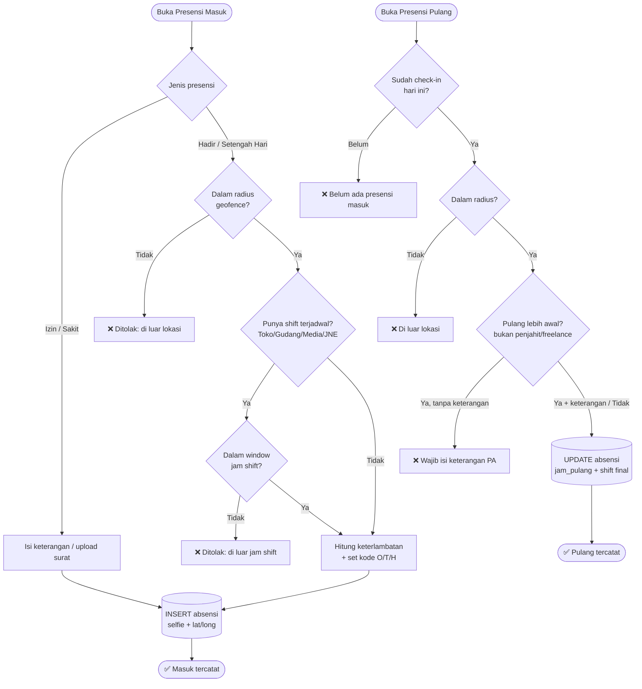

**Aturan penting:**
- **Geofence** divalidasi di check-in **dan** check-out (radius per lokasi, lihat §18).
- **Penjahit & Freelance** dibebaskan dari aturan "pulang awal" — boleh check-out kapan pun (freelance dibayar per jam/pcs, jam dihitung dari masuk–pulang).
- **1 presensi per hari**, tidak bisa diubah karyawan; hanya Admin yang bisa koreksi kode.

#### Blokir & Pulihkan Absensi (lupa check-out)

Untuk mencegah data absensi menggantung, sistem **memblokir** karyawan yang **kemarin** hadir tapi lupa check-out.

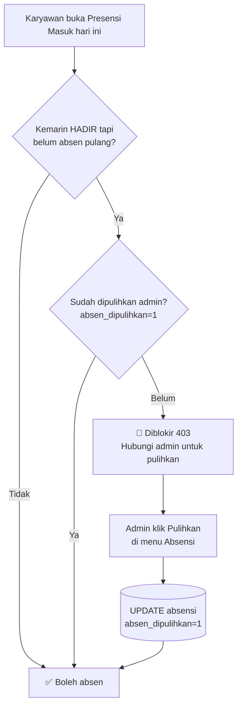

> Cek hanya **hari kemarin** (bukan semua hari lampau). Admin memulihkan lewat `POST /api/admin/attendance/recover`.

### 7.3 Lembur & Approval Berjenjang

Alur approval bergantung pada siapa penyetuju yang dipilih pengaju.

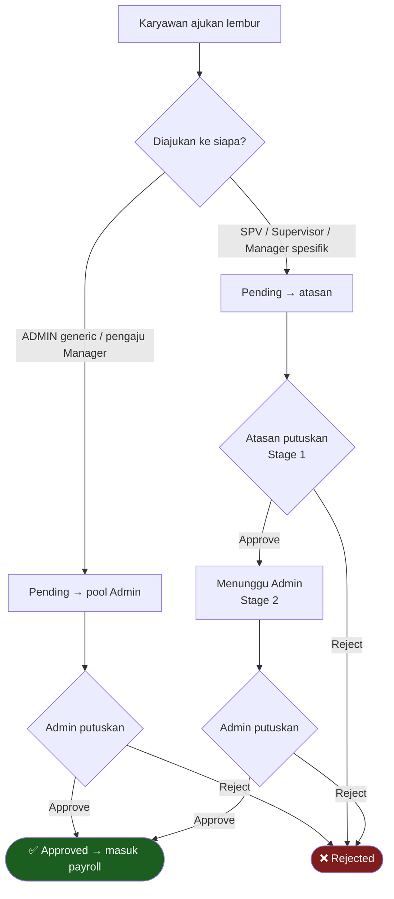

- **1x approval**: pengaju pilih **ADMIN** generic, atau pengaju berjabatan Manager (auto ke admin).
- **2x approval**: pengaju pilih atasan spesifik → atasan approve → **baru** admin bisa approve (admin tidak bisa approve sebelum atasan approve).
- Divisi **Produksi** wajib mengisi field tambahan (Nama Order, QTY, Target Sebelum/Setelah).
- Lembur **approved** otomatis menambah jam lembur di payroll periode tersebut.

### 7.4 Pinjaman (Lifecycle)

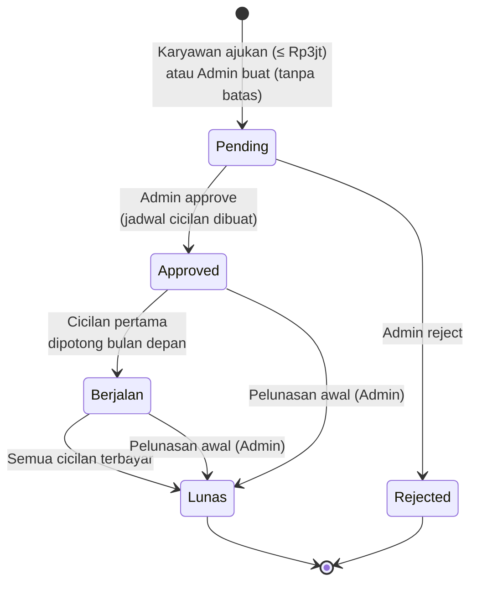

**Syarat pengajuan mandiri karyawan:** masa kerja ≥ 6 bulan, tidak ada pinjaman aktif, cooldown 4 bulan setelah lunas, maksimal Rp 3.000.000. Admin dapat membuat pinjaman darurat **tanpa batas**. Cicilan (`pinjaman_cicilan`) otomatis menjadi **potongan pinjaman** di payroll bulan bersangkutan.

### 7.5 Pipeline Payroll

Mesin payroll (`lib/payroll-summary.ts`) menggabungkan banyak sumber data **secara real-time** menjadi Take Home Pay per karyawan.

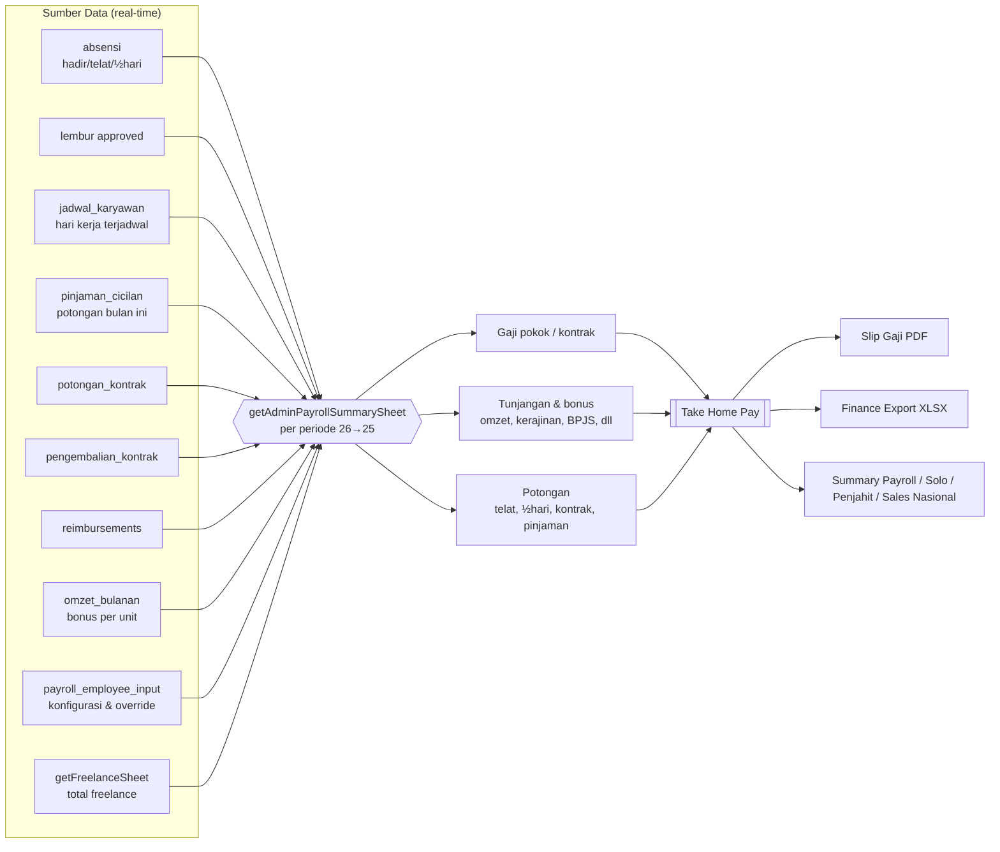

**Aturan turunan absensi (penting & konsisten dengan rekap):**
- **Telat** dihitung dari `kode_absensi = 'T'` (bukan recompute `terlambat_menit`).
- **Setengah hari** mengikuti resolusi kode absensi (`mapAttendanceCode`): `H`/`SH` = ya; `T`/`SX` + jam ½hari = ya; kode `O`/`PA` = **bukan** ½hari. Ini mencegah potongan palsu setelah admin mengganti kode manual.
- Periode: `getActivePayrollPeriod()` otomatis pindah ke bulan berikutnya bila tanggal > 25.

### 7.6 Payroll Freelance

Karyawan `jabatan = 'freelance'` dibagi 4 tipe (`tipe_freelance`), masing-masing punya cara hitung berbeda; totalnya menjadi **satu sumber kebenaran** yang juga dipakai slip gaji.

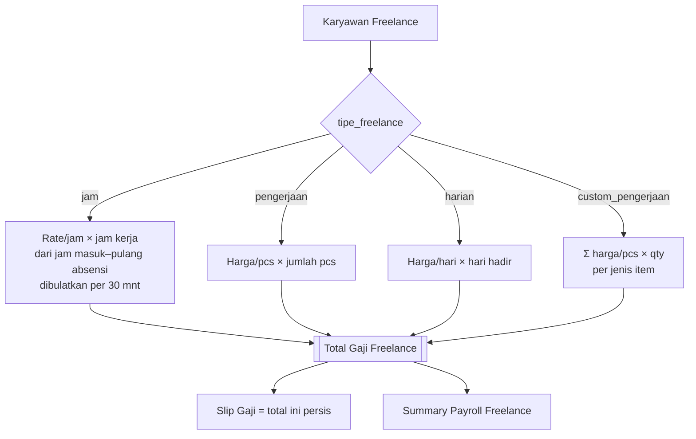

> Karena `getFreelanceSheet` menyaring berdasarkan **jabatan** `'freelance'`, mesin payroll mengenali freelancer lewat kehadirannya di sheet ini (bukan hanya `status_kepegawaian`) agar slip gaji **selalu sama** dengan Summary Payroll Freelance.

### 7.7 Slip Gaji & Distribusi

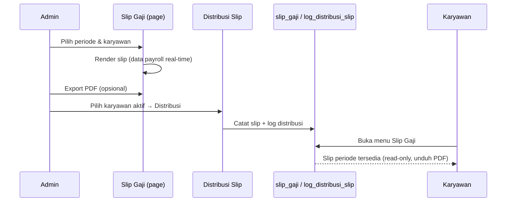

> Distribusi hanya menampilkan **karyawan aktif** (`status_data='aktif'`). Slip bonus dikelola terpisah (`bonus-slips`, `bonus-slip-distribution`).

---

## 8. Modul Bisnis (`lib/`)

| Modul | Tanggung jawab |
|-------|----------------|
| `db.ts` | Pool MySQL tunggal (cached global saat dev), `namedPlaceholders` |
| `auth.ts` | Sesi HMAC, guard peran, whitelist editor payroll & approver lembur |
| `admins.ts` | CRUD akun Admin & SPV (menu Role), schema role users |
| `employees.ts` | CRUD karyawan, signup, update profil, migrasi kolom karyawan |
| `attendance.ts` | Aturan shift, window jam, deteksi telat/½hari, foto, blokir & pulihkan absensi |
| `holidays.ts` | Libur nasional (tandai kode L massal) |
| `attendance-recompute.ts` | Recompute kode absensi & migrasi `app_migrations` |
| `hris.ts` | Rekap absensi (spreadsheet), `mapAttendanceCode`, set kode manual, dashboard |
| `jadwal-karyawan.ts` | Set jadwal shift, hari efektif |
| `geofence.ts` | Titik & radius lokasi, validasi jarak (haversine) |
| `overtime.ts`, `overtime-approval.ts` | Lembur, approval berjenjang, approver |
| `loans.ts` | Pinjaman, cicilan otomatis, pelunasan awal |
| `payroll-admin.ts` | Periode payroll, clone periode, omzet & grup unit |
| `payroll-summary.ts` | **Mesin payroll utama** (summary, THP, override) |
| `payroll-penjahit.ts` | Payroll penjahit mingguan/bulanan |
| `payroll-freelance.ts` | 4 tipe freelance + upsert rate/qty |
| `payroll-bonus.ts` | Payroll bonus sales/SPV/dll |
| `payslip-row.ts`, `bonus-slip.ts` | Map baris slip, slip bonus & distribusi |
| `contract-deductions.ts`, `contract-returns.ts`, `contract-timeline.ts` | Kontrak & deposit |
| `reimbursements.ts`, `business-trips.ts` | Reimburse & perjalanan dinas |
| `visit-reports.ts` | Laporan kunjungan sales |
| `hr-agent.ts` | HR Agent (Ollama, tool-calling read-only, tabel di-whitelist) |
| `*-roles.ts`, `payroll-constants.ts` | Konstanta peran & tarif (mis. omzet 0.7%) |
| `uploads.ts`, `api-json.ts` | Util upload & respons JSON |

---

## 9. Peta API Endpoint

Semua endpoint memvalidasi sesi peran terkait. Metode HTTP ditunjukkan per route.

### Auth (publik)
| Endpoint | Metode | Fungsi |
|----------|--------|--------|
| `/api/login` | POST | Login terpadu (routing per role) |
| `/api/signup` | POST | Registrasi akun karyawan |
| `/api/logout` | POST | Logout (hapus cookie) |
| `/api/mobile/login` | POST | Login mobile → Bearer token (khusus karyawan) |

### Karyawan (`/api/employee/*`)
| Endpoint | Metode | Fungsi |
|----------|--------|--------|
| `attendance/check-in` | POST | Presensi masuk (selfie+GPS) |
| `attendance/check-out` | POST | Presensi pulang |
| `attendance/today` | GET | Status presensi hari ini |
| `attendance/history` | GET | Riwayat absensi |
| `overtime` | GET/POST | Lihat & ajukan lembur |
| `overtime-approvals` `[id]` | GET/PATCH | Approval lembur (SPV-as-karyawan) |
| `loans` | GET/POST | Pinjaman |
| `payslips` | GET | Slip gaji |
| `bonus-slips` | GET | Slip bonus |
| `reimbursements` | GET/POST | Reimburse |
| `business-trips` | GET/POST | Perjalanan dinas |
| `contract` | GET | Info kontrak |
| `profile` | GET/PUT | Lihat & update data diri |
| `visit-report` | GET/POST | Laporan kunjungan |
| `overview` | GET | Ringkasan dashboard |

### Admin (`/api/admin/*`)
| Endpoint | Metode | Fungsi |
|----------|--------|--------|
| `employees` `[id]` | GET/POST/PUT/DELETE | CRUD karyawan |
| `employees/export` | GET | Export Excel data karyawan |
| `attendance/update` | POST | Ubah/koreksi kode absensi |
| `attendance/holiday` | POST/DELETE | Set/batal libur nasional (tandai L) |
| `attendance/recover` | POST | Pulihkan absensi yang terblokir |
| `overtime` `[id]` | GET/PATCH | Approve/reject lembur |
| `loans` `[id]` `[id]/payoff` | GET/POST/PATCH | Pinjaman + pelunasan awal |
| `payroll-summary` `[id]` | GET/POST/PATCH | Summary payroll + override |
| `payroll-summary/finance-export` | GET | Export finance (THP) XLSX |
| `payroll-bonus` `[id]` | GET/POST/PATCH | Payroll bonus |
| `payroll-freelance` | GET/POST | Payroll freelance |
| `freelance/{jam,harian,pengerjaan,custom-items,custom-pengerjaan}` | GET/POST/DELETE | Data 4 tipe freelance |
| `payslip-distribution` | POST/DELETE | Distribusi & batal slip gaji |
| `bonus-slip-distribution` | POST/DELETE | Distribusi slip bonus |
| `contract-deductions` `[id]` | GET/POST/PUT/DELETE | Potongan kontrak |
| `contract-returns` | GET/POST | Pengembalian kontrak |
| `reimbursements` `[id]` | GET/PATCH | Approve/reject reimburse |
| `business-trips` `[id]` | GET/PATCH | Approve/reject dinas |
| `visit-reports` `summary` | GET | Laporan kunjungan + ringkasan |
| `finance/lembur` | POST/DELETE | Lembur custom finance per unit |
| `roles` `[id]` | GET/POST/PATCH/DELETE | Kelola akun Admin & SPV |
| `hr-agent` | POST | Chat HR Agent (AI) |
| `login`, `logout` | POST | Sesi admin |

### SPV (`/api/spv/*`)
| Endpoint | Metode | Fungsi |
|----------|--------|--------|
| `jadwal` | GET/POST | Set jadwal shift |
| `overtime-approvals` `[id]` | GET/PATCH | Approval lembur tim |
| `logout` | POST | Sesi SPV |

### Berkas
| Endpoint | Metode | Fungsi |
|----------|--------|--------|
| `/api/uploads/[...path]` | GET | Serve file upload (via rewrite `/uploads/*`) |

---

## 10. Setup & Menjalankan

```bash
# 1) Install dependensi
npm install

# 2) Siapkan database MySQL
#    Buat database lalu import schema kanonik:
mysql -u root hris_payroll_app_v2 < db/hris_payroll_app_v2.sql

# 3) Buat file .env.local (lihat §11)

# 4) Seed akun admin (opsional)
node scripts/seed-admins.mjs

# 5) Jalankan dev server
npm run dev        # http://localhost:3000

# Build & production
npm run build
npm run start
npm run lint       # ESLint (eslint-config-next)
```

> Tabel yang belum ada akan dibuat otomatis saat modul terkait pertama diakses (migrasi lazy), sehingga import schema dasar + jalan aplikasi sudah cukup untuk lingkungan baru.

---

## 11. Environment Variables

| Variabel | Wajib | Default | Keterangan |
|----------|:-----:|---------|-----------|
| `DB_HOST` | ✔ | `127.0.0.1` | Host MySQL |
| `DB_PORT` | ✔ | `3306` | Port MySQL |
| `DB_USER` | ✔ | `root` | User MySQL |
| `DB_PASSWORD` |  | `` | Password MySQL |
| `DB_NAME` | ✔ | `hris_payroll_app_v2` | Nama database |
| `APP_SESSION_SECRET` | ✔ (prod) | *dev fallback* | **Kunci tanda tangan sesi** — wajib di production |
| `OLLAMA_HOST` |  | `https://ollama.com` | Endpoint HR Agent |
| `OLLAMA_KEY` |  | `` | API key Ollama Cloud |
| `OLLAMA_MODEL` |  | `gpt-oss:120b-cloud` | Model HR Agent |
| `SMTP_HOST/PORT/USER/PASS/FROM` |  | — | Kirim email (OTP/notifikasi) |

Contoh `.env.local`:

```env
DB_HOST=127.0.0.1
DB_PORT=3306
DB_USER=root
DB_PASSWORD=
DB_NAME=hris_payroll_app_v2
APP_SESSION_SECRET=ganti-dengan-string-acak-panjang
```

---

## 12. Deployment

- **Build**: `npm run build` menghasilkan output Next.js standar; jalankan `npm run start` di belakang reverse proxy (Nginx/hcdn).
- **Cache**: route login memakai header `no-store` + `dynamic = "force-dynamic"` agar CDN/WAF tidak menyimpan respons autentikasi.
- **Berkas upload** disimpan di filesystem (`public/uploads`) — pastikan volume persisten di production.
- **Wajib** set `APP_SESSION_SECRET` dan kredensial DB via environment. Terdapat `.env.railway` untuk konfigurasi Railway.
- Jalankan dengan Node.js (bukan edge runtime) karena memakai `mysql2` dan `node:crypto`.

---

## 13. Catatan Keamanan & Teknis

- **Password hashing SHA2-256 tanpa salt** — cukup untuk konteks internal, namun idealnya di-upgrade ke bcrypt/argon2 bila memungkinkan.
- **`APP_SESSION_SECRET`** menentukan integritas seluruh sesi; jangan pakai default di production.
- **HR Agent** hanya boleh membaca daftar tabel yang di-whitelist (mengecualikan `users.password` & `otp_codes`).
- **Geofence** memakai perhitungan jarak haversine; akurasi bergantung sinyal GPS klien.
- **Migrasi lazy** memudahkan evolusi schema, tetapi urutan kolom pada beberapa tabel bergantung pada `ALTER` idempotent — hindari mengandalkan posisi kolom.
- **Timezone** selalu Asia/Jakarta; hindari `new Date()` polos untuk logika tanggal payroll — gunakan helper periode.

---

# BAGIAN B — PANDUAN PENGGUNA

## 14. Peran & Hak Akses

Terdapat **3 jenis akun**:

| Peran | Akses | Login |
|-------|-------|-------|
| **Karyawan (Staff)** | Presensi, lembur, pinjaman, slip, reimburse | Halaman utama |
| **Supervisor / Manager** | Set jadwal + approval lembur tim | Otomatis di menu karyawan, atau login SPV khusus |
| **Admin** | Akses penuh seluruh sistem | Login admin |

> Supervisor/Manager yang berstatus karyawan aktif tetap bisa presensi pribadi; menu **Set Jadwal** & **Approval Lembur** muncul otomatis di area karyawan mereka.

### Ringkasan hak akses

| Fitur | Karyawan | SPV/Manager | Admin |
|-------|:--------:|:-----------:|:-----:|
| Check-in / Check-out | ✅ | ✅ | — |
| Lihat absensi sendiri | ✅ | ✅ | ✅ |
| Lihat/edit absensi semua | — | — | ✅ |
| Ajukan lembur | ✅ | ✅ | — |
| Approve lembur (atasan / final) | — | ✅ (stage 1) | ✅ (final) |
| Set jadwal shift | — | ✅ | ✅ |
| Ajukan pinjaman (≤ Rp3jt) | ✅ | ✅ | — |
| Buat/approve pinjaman | — | — | ✅ |
| Lihat slip sendiri | ✅ | ✅ | ✅ |
| Kelola payroll & distribusi slip | — | — | ✅ |
| Kelola karyawan / role | — | — | ✅ |
| Approval reimburse & dinas | — | — | ✅ |

---

## 15. Alur Karyawan

### 15.1 Registrasi & Login
- **Daftar** (Sign Up) dengan email + password (min 6 karakter) di halaman utama.
- **Login** → diarahkan ke area karyawan. Lupa password → hubungi Admin HR.
- **Dashboard Karyawan** (`/employee`): ringkasan pribadi (absensi, lembur, pinjaman, slip) langsung dari database.

### 15.2 Lengkapi Data Diri (Profile)
Menu **Profile** — lengkapi/edit: nama, jenis kelamin, tempat & tanggal lahir, **NIK** (unik), agama, no HP, alamat KTP & domisili, **foto KTP**, bank, no rekening. Data kepegawaian (jabatan, divisi, gaji) diisi oleh Admin.

### 15.3 Presensi Masuk (Check-In)
Pilih jenis presensi, lalu:

| Pilihan | Kode | Syarat |
|---------|------|--------|
| Masuk (Hadir) | O | Selfie + GPS |
| Izin / Off | I | Wajib keterangan |
| Sakit + Surat | S | Upload surat |
| Sakit tanpa surat | SX | Wajib keterangan |
| Setengah Hari | H | Selfie + GPS |

Aturan: **1x sehari**, tidak bisa diubah; untuk Toko/Gudang/Media/JNE divalidasi jam shift; jadwal **libur** menolak presensi; keterlambatan dihitung otomatis. **Jika kemarin lupa check-out**, presensi hari ini diblokir sampai Admin memulihkan (lihat [§7.2](#blokir--pulihkan-absensi-lupa-check-out)).

### 15.4 Presensi Pulang (Check-Out)
Selfie + GPS. Harus sudah check-in. **Pulang Awal (PA)** wajib keterangan (kecuali penjahit & freelance yang dibebaskan). Shift final disimpan otomatis.

### 15.5 Pengajuan Lembur
Isi tanggal, jam mulai–selesai, penyetuju, jenis pekerjaan, deadline. **Divisi Produksi** wajib mengisi Nama Order, QTY, Target Sebelum/Setelah. Dropdown penyetuju bergantung jabatan pengaju (Staff→SPV/atasan/ADMIN; Supervisor→Manager/ADMIN; Manager→ADMIN otomatis). Lihat alur approval di [§7.3](#73-lembur--approval-berjenjang).

### 15.6 Pengajuan Pinjaman
Syarat: masa kerja ≥ 6 bulan, tidak ada pinjaman aktif, cooldown 4 bulan setelah lunas, maks Rp 3.000.000. Sistem menampilkan preview potongan/bulan. Lihat lifecycle di [§7.4](#74-pinjaman-lifecycle).

### 15.7 Slip Gaji & Bonus
Lihat & unduh slip per periode (tersedia setelah Admin distribusi). Header **AvA Group**.

### 15.8 Reimburse & Perjalanan Dinas
Ajukan dengan bukti/detail → menunggu persetujuan Admin.

### 15.9 Riwayat Absensi & Kontrak
Rekap presensi pribadi (jam, status, kode, keterangan PA) dan info kontrak + riwayat potongan (read-only).

### 15.10 Laporan Kunjungan (Sales)
Karyawan sales area mengirim laporan kunjungan (dengan lokasi) beberapa kali per hari via menu Laporan Kunjungan.

### 15.11 Set Jadwal (SPV/Manager/Scheduler)
Karyawan berhak (Supervisor, Manager, atau di-whitelist) mendapat menu **Setup Jadwal** & **Approval Lembur** di area karyawan — lihat [§16](#16-alur-supervisor--manager).

---

## 16. Alur Supervisor & Manager

### 16.1 Set Jadwal
Bisa dilakukan SPV/Manager/Admin (dan karyawan yang di-whitelist scheduler). Pilih bulan → klik sel (karyawan × tanggal) → pilih shift → simpan.

**Shift & window jam** — lihat [§18.2](#182-shift--jam-kerja). **Aturan shift per penempatan:**

| Penempatan | Shift diperbolehkan |
|-----------|--------------------|
| Toko Solo | pagi, libur |
| JNE | jne_pagi, jne_siang, jne_minggu, libur |
| Media (sub divisi) | pagi, siang, libur |
| Lainnya | pagi, siang, lembur, setengah_1, setengah_2, libur |

### 16.2 Approval Lembur
Hanya pengajuan yang ditujukan kepada Anda yang muncul. Approve/Reject + catatan. Setelah Anda approve → masuk ke Admin (stage 2). Jika Anda reject → langsung final rejected.

---

## 17. Alur Admin

Sidebar admin dikelompokkan menjadi **8 grup** (`components/AdminShell.tsx`). Tabel di bawah mengikuti pengelompokan tersebut secara lengkap.

**Dashboard** — ringkasan panel admin (statistik karyawan, presensi hari ini, payroll & slip tertunda).

**🧑 Manajemen Karyawan**
| Menu | Ringkasan |
|------|-----------|
| **Data Karyawan** | CRUD, nonaktifkan, upload/download KTP, atur bank & rekening |
| **Set Jadwal** | Jadwal shift semua karyawan tanpa batasan penempatan |
| **HR Agent** | Tanya-jawab data HR berbasis AI (read-only ke DB) |

**🕐 Absensi & Aktivitas**
| Menu | Ringkasan |
|------|-----------|
| **Absensi** | Rekap semua karyawan, filter, modal Detail (foto/peta), ubah kode manual, **set libur nasional** (tandai L massal), **Pulihkan** absensi terblokir |
| **Lembur** | 2 tab (Langsung ke Admin / Via Atasan), modal detail, approve/reject |
| **Laporan Kunjungan** | Timeline kunjungan Sales Area + ringkasan |

**✅ Approval**
| Menu | Ringkasan |
|------|-----------|
| **Approval Perjalanan Dinas** | Approve/reject dinas luar kota karyawan |
| **Approval Reimburse** | Approve/reject nota reimburse |

**💰 Payroll**
| Menu | Ringkasan |
|------|-----------|
| **Summary Payroll** | Mesin payroll utama; edit override, input omzet, real-time |
| **Summary Payroll Solo** | Khusus penempatan Toko Solo (omzet tanpa multiplier) |
| **Payroll Bonus** | Bonus Sales, SPV, Manager, CS, Host Live, Marketplace, Media, Advertiser |
| **Summary Sales Nasional** | Sales Nasional (komisi & omzet) |
| **Summary Penjahit** | Penjahit mingguan & bulanan |
| **Summary Payroll Freelance** | 4 tipe freelance (jam/pengerjaan/harian/custom) |

**🧾 Slip Gaji**
| Menu | Ringkasan |
|------|-----------|
| **Slip Gaji** | Render slip, export PDF |
| **Distribusi Slip** | Distribusi ke karyawan aktif + log |
| **Slip Bonus** | Slip bonus (terpisah dari slip gaji) |
| **Distribusi Slip Bonus** | Distribusi & log slip bonus |

**🏦 Keuangan & Kontrak**
| Menu | Ringkasan |
|------|-----------|
| **Finance** | Rekap keuangan per unit + lembur custom, export XLSX |
| **Pinjaman** | Buat pinjaman darurat (tanpa batas), approve/reject, pelunasan awal |
| **Potongan Kontrak** | Potongan kontrak per bulan per karyawan |
| **Pengembalian Kontrak** | Pengembalian deposit kontrak (5 bulan) |

**⚙️ Pengaturan**
| Menu | Ringkasan |
|------|-----------|
| **Role** | Kelola akun Admin & SPV |

**Periode payroll:** 26 (M-1) → 25 (M). Contoh: Juni = 26 Mei – 25 Juni. Otomatis pindah periode jika tanggal > 25. Karyawan nonaktif hilang dari periode berikutnya.

**Pemisahan halaman payroll:** karyawan **Toko Solo** dan **Penjahit** tidak muncul di Summary Payroll utama — masing-masing punya halaman sendiri.

---

## 18. Aturan Sistem

### 18.1 Aturan Presensi
1 presensi/hari · tidak bisa diubah karyawan · Admin bisa koreksi · selfie & GPS wajib untuk hadir · keterangan wajib untuk izin/sakit tanpa surat · surat wajib untuk sakit resmi · PA wajib keterangan (kecuali penjahit/freelance) · **lupa check-out kemarin → diblokir sampai Admin "Pulihkan"** · **libur nasional** ditandai kode L massal oleh Admin.

### 18.2 Shift & Jam Kerja

| Shift | Check-In | Check-Out |
|-------|----------|-----------|
| pagi | 08:00–08:30 | 16:30–17:30 |
| siang | 11:45–12:00 | 20:00–21:00 |
| lembur | 09:45–10:00 | 20:00–21:00 |
| setengah_1 | 10:30–13:00 | 16:30–17:30 |
| setengah_2 | 08:00–08:30 | 12:00–13:00 |
| pagi_full | 08:00–08:30 | 16:30–17:30 |
| pagi_short | 08:00–08:30 | 14:30–15:30 |
| siang_sore | 11:45–12:00 | 16:30–17:30 |
| jne_pagi | 07:30–11:00 | 15:30–16:30 |
| jne_siang | 13:30–17:00 | 20:30–21:30 |
| jne_minggu | 12:30–14:00 | 19:30–20:30 |
| libur | — | — |

**Toleransi telat:** JNE 10 menit; shift lain 5 menit.

### 18.3 Geofence (radius lokasi)

| Lokasi | Radius |
|--------|--------|
| Office (Jl. Wonocatur) | 50 m |
| Toko (AVA Sport Store) | 50 m |
| Toko Solo (Kartasura) | 50 m |
| Ayres Apparel | 50 m |
| JNE Ambarrukmo | 50 m |
| Bank BCA KC Adisucipto | 100 m |
| Gudang Avasportivo | 25 m |

> **WFA (Work From Anywhere)** tidak terkena validasi geofence.

### 18.4 Aturan Periode Payroll
Rentang 26 (M-1) – 25 (M) · hari kerja Senin–Sabtu (tanpa Minggu) · real-time dari absensi · karyawan nonaktif hilang periode berikutnya.

### 18.5 Omzet & Bonus
- Grup **AVA + Ayres** → bonus = total omzet × **0,7%**, dibagi ke karyawan eligible × role factor.
- **JNE** → `is_custom_bonus`, nominal input dipakai langsung.
- **Toko Solo** → input manual tanpa multiplier.
- CEO & Freelance **tidak** dapat bonus omzet (factor 0).

---

## 19. Kode Status Presensi

| Kode | Nama | Keterangan |
|------|------|-----------|
| **O** | Hadir | Masuk tepat waktu |
| **T** | Terlambat | Masuk setelah jam shift (+toleransi) |
| **I** | Izin | Izin/Off (dengan keterangan) |
| **S** | Sakit | Dengan surat |
| **SX** | Sakit tanpa surat | Tanpa dokumen |
| **H** | Setengah Hari | Hadir ½ hari |
| **PA** | Pulang Awal | Pulang sebelum jam checkout + keterangan (di DB: hadir + keterangan) |
| **L** | Libur | Libur terjadwal |
| **A** | Alfa | Tidak hadir tanpa keterangan |
| **C** | Cuti | Cuti resmi |

---

## 20. FAQ

**GPS tidak akurat?** Pastikan GPS aktif & izin diberikan, tunggu sinyal, pakai tombol Refresh, pindah ke area terbuka.

**Lupa check-out kemarin?** Hubungi Admin — karyawan tidak bisa mengisi check-out hari lampau.

**Saya diblokir tidak bisa absen masuk hari ini?** Ini terjadi bila **kemarin Anda hadir tapi lupa check-out**. Hubungi Admin untuk klik **Pulihkan** di menu Absensi, lalu Anda bisa absen lagi.

**Bagaimana libur nasional dicatat?** Admin menandai tanggal libur nasional; seluruh karyawan otomatis diberi kode **L** untuk tanggal tersebut.

**Apakah ada aplikasi mobile?** Ada endpoint `POST /api/mobile/login` yang mengembalikan token untuk aplikasi mobile karyawan (memakai skema sesi yang sama dengan web).

**Salah status check-in?** Tidak bisa diubah sendiri; Admin dapat mengoreksi kode via modal detail absensi.

**Lembur sudah di-approve atasan tapi masih "menunggu admin"?** Karena Anda memakai alur **2x approval** (via atasan). Setelah atasan approve, admin masih perlu finalisasi. Pilih **ADMIN** generic saat submit bila ingin 1x approve.

**Baru kerja 4 bulan, kapan bisa pinjam?** Setelah masa kerja **6 bulan**.

**Cicilan belum terpotong?** Cicilan tercermin saat payroll periode terkait dihitung.

**PA vs Izin?** PA = sudah check-in hadir lalu pulang sebelum jam checkout (tetap hadir + keterangan). Izin = tidak masuk sejak awal.

**Karyawan Toko Solo tidak muncul di Summary utama?** Sengaja dipisah ke **Summary Payroll Solo**. Slip gaji Anda tetap normal.

**Slip belum muncul?** Slip tersedia setelah Admin mendistribusikannya.

**Freelance dihitung bagaimana?** Sesuai `tipe_freelance` (jam/pengerjaan/harian/custom) — lihat [§7.6](#76-payroll-freelance). Slip gaji mengikuti total di Summary Payroll Freelance persis.

**Bisa check-in di luar jam shift?** Untuk karyawan bershift (Toko/Gudang/Media/JNE), check-in di luar window ditolak. Karyawan lain diterima namun telat tetap dicatat.

---

> **Kendala teknis atau pertanyaan lain → hubungi Admin HR AvA Group.**
>
> *Dokumentasi ini mencakup arsitektur teknis dan panduan pengguna sistem Web HR AvA Group.*
