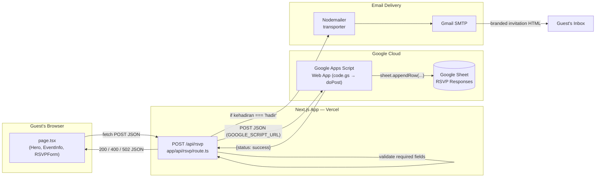
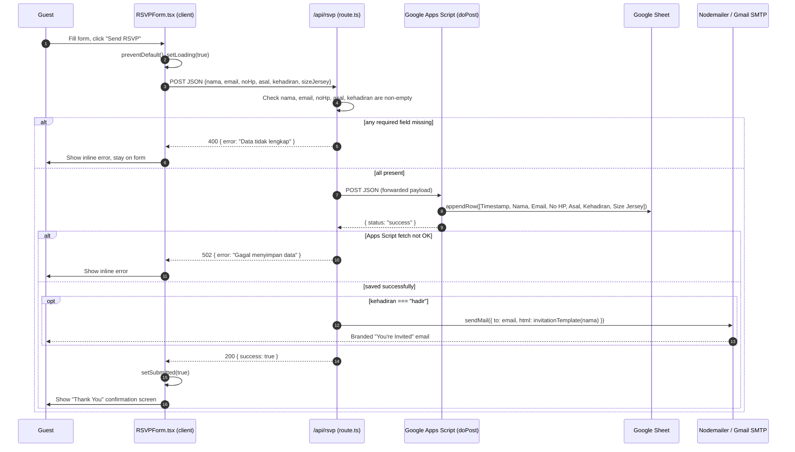
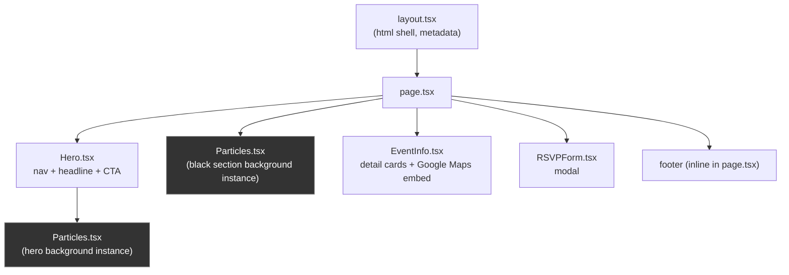

# Ayres Apparel — Grand Opening Solo

### Digital Invitation Website

---

## Overview

A single-page, web-based digital invitation for the **Grand Opening of Ayres Apparel Solo Branch** — home of custom jerseys crafted with genuine Indonesian character.

The site is a marketing/RSVP landing page: a WebGL particle hero, event detail cards with an embedded map, and an RSVP modal form. On submit, the response is appended to a Google Sheet (via a Google Apps Script Web App acting as a lightweight database/webhook) and, if the guest marks themselves as attending, a branded HTML invitation email is sent automatically through Gmail SMTP.

There is no database, no authentication, and no admin panel — the Google Sheet *is* the data store, and the Apps Script deployment is the only server-side integration besides the mail transporter.

---

## Tech Stack

| Layer | Technology | Notes |
|---|---|---|
| Frontend | Next.js 16 (App Router) | React 19, client components (`"use client"`) for anything interactive |
| Styling | Tailwind CSS v4 | Theme tokens (`--red`, `--gold`, …) defined in `app/globals.css` via `@theme inline` |
| 3D / Animation | [OGL](https://github.com/oframe/ogl) | Hand-rolled WebGL particle field (`Particles.tsx`), not Three.js despite `three`/`@react-three/*` being installed |
| Backend API | Next.js Route Handler | `app/api/rsvp/route.ts` — one `POST` endpoint |
| Data store | Google Sheets | Written to via a Google Apps Script Web App (`code.gs`), not a database |
| Email | Nodemailer over Gmail SMTP | Fires only when `kehadiran === "hadir"` |
| Deployment | Vercel | Env vars configured in the Vercel dashboard |

> **Note on unused dependencies:** `three`, `@react-three/fiber`, and `@react-three/drei` are installed but not imported anywhere in `app/`. The particle background is implemented directly with raw OGL, not react-three-fiber. See [Audit Findings](#audit-findings--recommendations) below.

---

## Architecture



**Why a Google Apps Script instead of a real backend/database?** It's a zero-infrastructure spreadsheet-as-a-database pattern: the Sheet is both the storage and the guest list the organizer reads directly, with no server, ORM, or hosting cost beyond Vercel + free Google services.

---

## Request Flow — RSVP Submission



Key behavioral details baked into `app/api/rsvp/route.ts`:

- **Email is conditional** — only sent when `kehadiran === "hadir"` ("Not Attending" guests are recorded but get no email).
- **Sheet write happens before email send**, and blocks on the Apps Script response (`await fetch(...)`); if that call fails the route returns `502` before ever attempting to email.
- **The `GOOGLE_SCRIPT_URL` never reaches the browser** — it's read from `process.env` inside the server-only Route Handler, not a `NEXT_PUBLIC_*` variable.

---

## Component Map



`Particles.tsx` is mounted **twice** with different props — once inside `Hero` (denser, opaque particles, mouse-reactive) and once behind the rest of the page in `page.tsx` (sparser, alpha-blended, slower). Each instance owns its own OGL `Renderer`/`Camera`/animation loop.

---

## Project Structure

```
/app
  layout.tsx                → Root HTML shell, <html lang="id">, page metadata (title/OG tags)
  page.tsx                  → Composes Hero + black-background Particles + EventInfo + RSVPForm + footer
  globals.css                → Tailwind v4 import, color theme tokens, custom keyframes
  icon.png                   → Next.js file-convention favicon (auto-served, no manual <link> needed)

  /components
    Hero.tsx                 → Fixed nav, particle background, headline, date badge, "Confirm Attendance" CTA
    Particles.tsx             → Reusable OGL WebGL particle field (used by Hero + page background)
    EventInfo.tsx             → Date / Time / Location / Voucher cards + embedded Google Maps iframe
    RSVPForm.tsx               → "RSVP Now" trigger + native <dialog> modal with the RSVP form itself
    Beams.tsx, Galaxy.tsx,
    Lightning.tsx,
    RippleGrid.tsx            → NOT imported anywhere — unused alternative WebGL backgrounds (dead code, see audit)

  /api
    /rsvp
      route.ts                → POST handler: validates payload → forwards to Google Apps Script → conditionally emails guest

/public
  /logo/1.png                 → Ayres logo (used in Hero nav)
  Logo Ayres only white.png   → NOT referenced in code (dead asset)
  file.svg, globe.svg,
  next.svg, vercel.svg,
  window.svg                  → Default create-next-app scaffold icons, NOT referenced (dead assets)

code.gs                       → Google Apps Script source (deployed manually via the Apps Script editor, not part of the Next.js build)
```

---

## Data Model — Field Reference

The RSVP form, the API payload, and the Google Sheet columns all share the same field names (Indonesian). This is the single source of truth for what a submission looks like end to end:

| Form field (`RSVPForm` state) | UI Label | Input type | Required (client) | Required (server) | Google Sheet column | Used in email |
|---|---|---|---|---|---|---|
| `nama` | Full Name | text | ✅ | ✅ | Nama | ✅ greeting ("Dear {nama}") |
| `email` | Email | email | ✅ | ✅ | Email | ✅ send-to address |
| `noHp` | Phone / WhatsApp | tel | ✅ | ✅ | No HP | — |
| `asal` | Origin (community/org/company) | text | ✅ | ✅ | Asal | — |
| `kehadiran` | Attendance | radio: `hadir` \| `tidak` | ✅ | ✅ | Kehadiran | ✅ gates whether email is sent at all |
| `sizeJersey` | Jersey Size | select: `S`/`M`/`L`/`XL` | ✅ | ⚠️ **not validated** | Size Jersey | — |
| — (server-generated) | Timestamp | `new Date()` in Apps Script | — | — | Timestamp | — |

⚠️ = see [Audit Findings](#audit-findings--recommendations) — `sizeJersey` is marked `required` in the HTML `<select>` but `app/api/rsvp/route.ts` never checks for it, so a direct API call can omit it.

---

## Environment Variables

Create a `.env.local` file in the project root (already covered by `.gitignore`, never commit real credentials):

```env
# Google Apps Script Web App URL — receives the RSVP payload and appends a row to the Sheet
GOOGLE_SCRIPT_URL=your_google_apps_script_deployment_url

# Gmail SMTP — sends the invitation email to guests who mark themselves as attending
SMTP_HOST=smtp.gmail.com
SMTP_PORT=587
SMTP_USER=your_email@gmail.com
SMTP_PASS=your_gmail_app_password
SMTP_FROM=your_email@gmail.com
```

> For `SMTP_PASS`, use a [Gmail App Password](https://myaccount.google.com/apppasswords) (requires 2FA enabled on the account) — never the regular account password.

---

## Google Apps Script Setup (`code.gs`)

`code.gs` is **not** deployed by `next build` — it lives in this repo only as a reference copy and must be pasted into the Apps Script editor manually:

1. Create a new Google Sheet.
2. **Extensions → Apps Script**, paste the contents of `code.gs` into `Code.gs`.
3. Add a header row to the first sheet: `Timestamp | Nama | Email | No HP | Asal | Kehadiran | Size Jersey`.
4. **Deploy → New deployment**:
   - Type: **Web app**
   - Execute as: **Me**
   - Who has access: **Anyone**
5. Copy the deployment URL into `.env.local` as `GOOGLE_SCRIPT_URL`.

The script exposes two entry points:
- `doPost(e)` — parses the JSON body, appends a row, returns `{ status: "success" }` or `{ status: "error", message }`.
- `doGet()` — returns a plain-text "RSVP API is running" health check.

---

## Getting Started

```bash
npm install
npm run dev
```

Open [http://localhost:3000](http://localhost:3000). Requires a valid `.env.local` for the RSVP form to actually persist data / send email — without it, `POST /api/rsvp` will 500 (missing `GOOGLE_SCRIPT_URL`) or fail on SMTP auth.

Other scripts:

```bash
npm run build   # production build
npm run start   # serve the production build
npm run lint    # eslint (flat config, eslint-config-next core-web-vitals + typescript)
```

---

## Deployment

Deploy via [Vercel](https://vercel.com). Add all six environment variables from [Environment Variables](#environment-variables) under **Project Settings → Environment Variables** for every environment you deploy (Production/Preview/Development) — the Route Handler will fail closed (400/500) without them.

---

## Audit Findings & Recommendations

A focused review of the current implementation surfaced the following. None are blocking for a small, low-traffic event invite, but they're worth knowing before reusing this pattern for something higher-stakes.

### Correctness / robustness

1. **Client/server validation mismatch on `sizeJersey`.** The `<select>` has `required`, but `app/api/rsvp/route.ts`'s guard clause (`if (!nama || !email || !noHp || !asal || !kehadiran)`) omits it. A direct `curl`/`fetch` to `/api/rsvp` can submit with no jersey size, silently writing an empty "Size Jersey" cell.
2. **No format validation server-side.** `email` and `noHp` rely entirely on HTML5 `type="email"`/`type="tel"`, which only apply in a real browser form submission. Any client bypassing the UI can post malformed data straight into the Sheet and, for `email`, into `sendMail`'s `to` field.
3. **No `try/catch` in the route handler.** `request.json()`, the `fetch()` to `GOOGLE_SCRIPT_URL`, and `transporter.sendMail()` are all unguarded. A malformed JSON body, a network blip talking to Apps Script, or an SMTP auth failure all throw and fall through to Next.js's generic unhandled-error 500 — the guest still just sees "Something went wrong," but nothing is logged server-side to diagnose which of the three failed.
4. **No idempotency / duplicate-submission guard.** Nothing stops the same guest (or a script) from submitting the form repeatedly — each submission appends a new Sheet row and, if attending, triggers another invitation email. The form copy says "Undangan ini berlaku untuk 1 orang," but that's unenforced.
5. **No rate limiting or bot protection** (no CAPTCHA, no honeypot field, no per-IP throttling) on a publicly reachable `POST` endpoint. At scale this risks Sheet spam and burning through Gmail's SMTP sending quota.
6. **The Google Apps Script trusts any caller.** Deployment access is "Anyone," and `doPost` performs no shared-secret/token check. `GOOGLE_SCRIPT_URL` itself is kept server-side and never sent to the browser (good), but if that URL ever leaks, anyone can POST directly to Apps Script and bypass the Next.js validation entirely. Consider adding a shared-secret header/query param checked inside `doPost`.

### Dead code / repo hygiene

7. **`Beams.tsx`, `Galaxy.tsx`, `Lightning.tsx`, `RippleGrid.tsx`** (~1,138 lines total, added in commit `c0a816f`) are not imported anywhere in `app/`. They appear to be alternative WebGL background candidates that lost out to `Particles.tsx`. Either delete them or move them to a clearly-labeled `experiments/` location — as-is they're maintenance surface with no runtime effect.
8. **`public/Logo Ayres only white.png`** and the default `create-next-app` scaffold icons (`file.svg`, `globe.svg`, `next.svg`, `vercel.svg`, `window.svg`) are unreferenced.
9. **Unused dependencies**: `three`, `@react-three/fiber`, `@react-three/drei` are in `package.json` but nothing under `app/` imports them — the particle system uses raw `ogl` instead. Safe to remove if no future component needs them, to shrink `node_modules`/install time.

### Notes on things that are already done well

- Secrets (`.env.local`) are correctly excluded via `.gitignore`'s blanket `.env*` rule.
- `GOOGLE_SCRIPT_URL` and SMTP credentials are read only inside the server-side Route Handler — never exposed to client-side JavaScript.
- TypeScript `strict` mode is enabled.
- The email is only sent on the "attending" path, avoiding sending a full HTML invitation to guests who declined.

---

## License

Private project for Ayres Apparel. All rights reserved.
