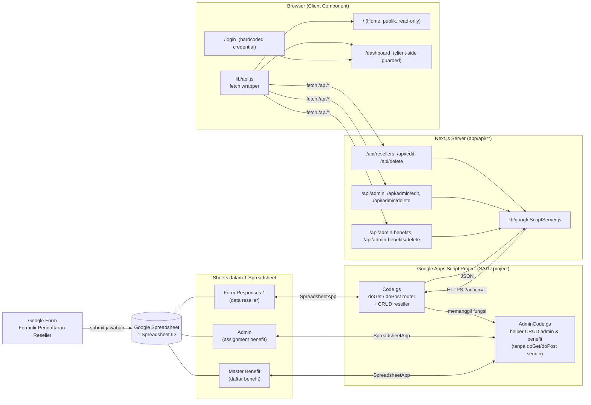
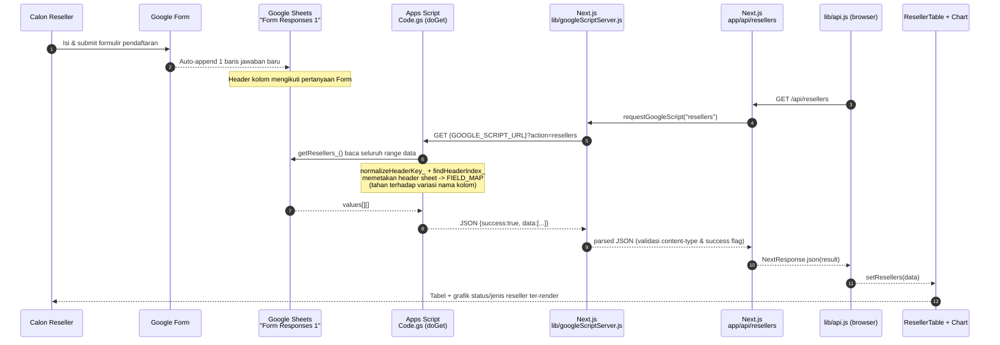
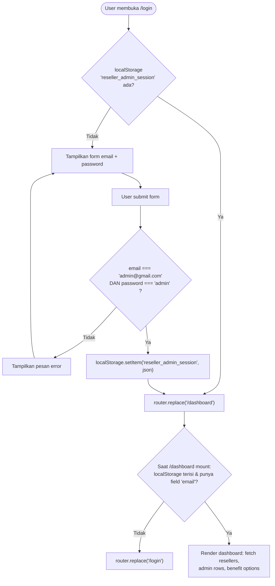
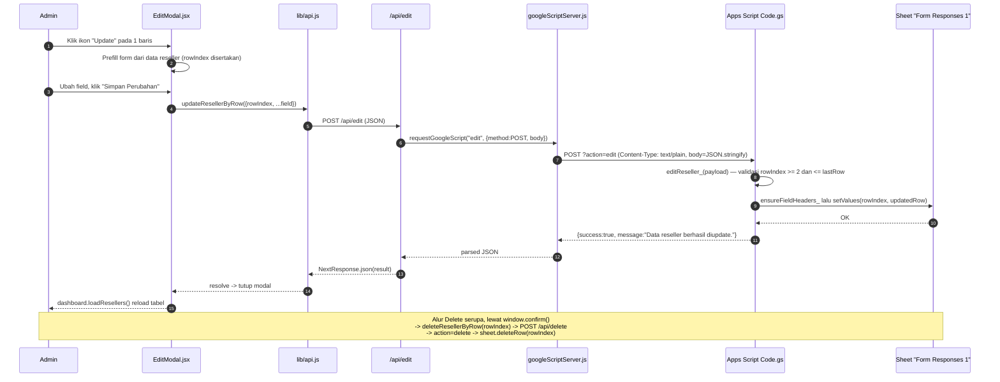
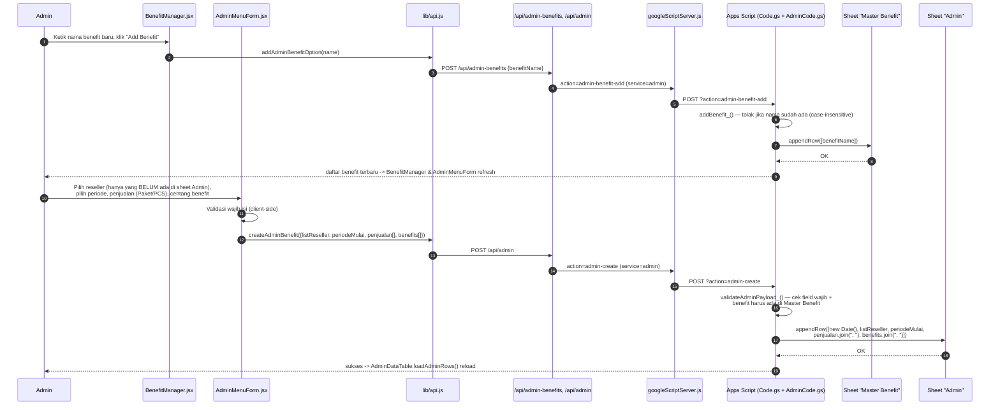
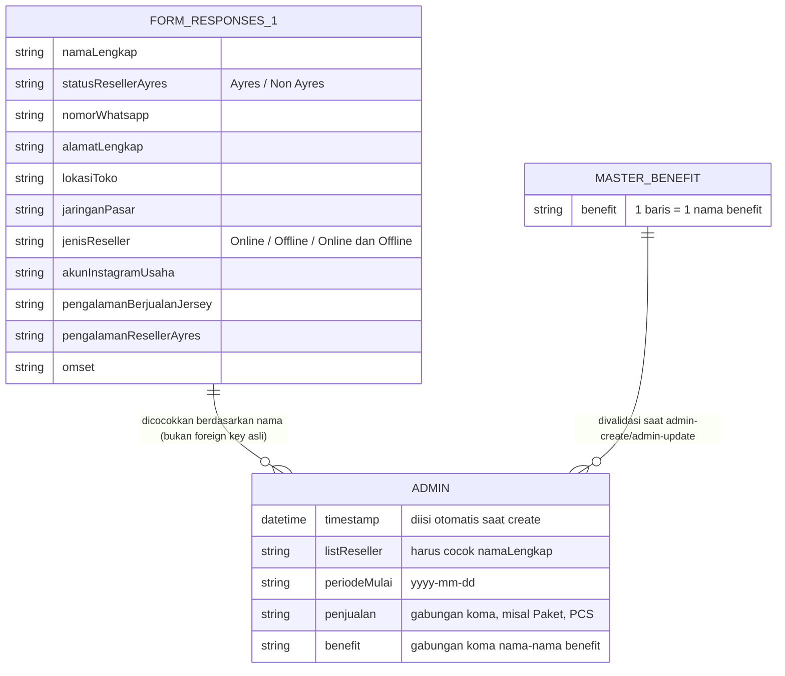
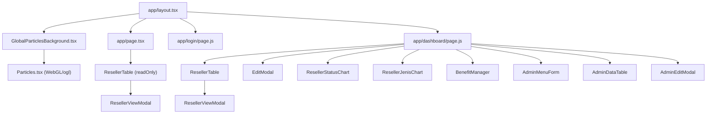

# Web Admin Reseller — Ayres (Next.js + Google Sheets API)

Dashboard admin untuk mengelola data reseller yang masuk dari **Google Form**, disimpan di **Google Sheets**, diakses lewat **Google Apps Script (Web App)**, dan ditampilkan/diolah melalui **Next.js App Router**.

Alur singkat:

```
Google Form → Google Sheets → Google Apps Script (Web App) → Next.js API Routes (BFF) → React UI
```

> Dokumen ini adalah hasil audit menyeluruh terhadap seluruh source code project (frontend Next.js, API internal, dan Google Apps Script). Selain menjelaskan cara pakai, dokumen ini juga mencatat temuan arsitektur & keamanan yang perlu diketahui sebelum deploy ke production — lihat [Catatan Audit & Keterbatasan](#catatan-audit--keterbatasan).

## Daftar Isi

- [Ringkasan Arsitektur](#ringkasan-arsitektur)
- [Tech Stack](#tech-stack)
- [Struktur Direktori](#struktur-direktori)
- [Alur Data End-to-End](#alur-data-end-to-end)
- [Alur Autentikasi Admin](#alur-autentikasi-admin)
- [Alur Halaman Publik (Home)](#alur-halaman-publik-home)
- [Alur Dashboard — Data Reseller (CRUD)](#alur-dashboard--data-reseller-crud)
- [Alur Dashboard — Menu Admin (Assign Benefit)](#alur-dashboard--menu-admin-assign-benefit)
- [Peta Halaman (Routing)](#peta-halaman-routing)
- [Peta API Internal Next.js](#peta-api-internal-nextjs)
- [Referensi Endpoint Google Apps Script](#referensi-endpoint-google-apps-script)
- [Skema Data (Spreadsheet)](#skema-data-spreadsheet)
- [Peta Komponen React](#peta-komponen-react)
- [Manajemen State di Dashboard](#manajemen-state-di-dashboard)
- [Environment Variables](#environment-variables)
- [Setup & Menjalankan Secara Lokal](#setup--menjalankan-secara-lokal)
- [Setup Google Apps Script (PENTING — dibaca dulu)](#setup-google-apps-script-penting--dibaca-dulu)
- [Scripts NPM](#scripts-npm)
- [Catatan Audit & Keterbatasan](#catatan-audit--keterbatasan)
- [Rekomendasi Pengembangan Lanjutan](#rekomendasi-pengembangan-lanjutan)

---

## Ringkasan Arsitektur

Project ini **tidak punya database sendiri** — Google Sheets berperan sebagai database, dan Google Apps Script berperan sebagai backend/API layer di atas spreadsheet tersebut. Next.js tidak pernah bicara langsung ke Google Sheets API; semua komunikasi ke Apps Script dilakukan **dari server** (Next.js Route Handler), bukan dari browser. Ini membuat Next.js API routes berfungsi sebagai **BFF (Backend-For-Frontend)** yang menyembunyikan URL Apps Script dari network tab browser (meski, lihat catatan audit, hal ini belum sepenuhnya menutup celah keamanan).



**Poin penting arsitektur:**

1. **Satu spreadsheet, tiga sheet.** `Form Responses 1` (hasil Google Form), `Admin` (data assignment benefit per reseller, GID `130319666`), dan `Master Benefit` (daftar nama benefit yang bisa dipilih). Ketiganya berbagi `SPREADSHEET_ID` yang sama.
2. **Satu project Apps Script, dua file kode.** `AdminCode.gs` **tidak** mendefinisikan `doGet`/`doPost` sendiri — komentar di file itu eksplisit menyatakan *"Admin API handlers are routed through the main doGet/doPost in Code.gs"*. Artinya `Code.gs` dan `AdminCode.gs` **wajib** berada di project Apps Script yang sama agar fungsi seperti `getAdminRows_`, `createAdminRow_`, `getBenefitList_`, dsb. bisa dipanggil oleh router di `Code.gs`. (README versi sebelumnya menyuruh membuat "project Apps Script admin terpisah" — ini keliru dan sudah diperbaiki di bagian [Setup Google Apps Script](#setup-google-apps-script-penting--dibaca-dulu)).
3. **Routing berbasis query param `action`, bukan path.** `getRoute_(e)` di `Code.gs` membaca `e.parameter.action` (atau `pathInfo`), lalu di-dispatch manual dengan rangkaian `if (route === "/edit") ...`. Ini berarti satu URL deployment `.../exec` yang sama sebenarnya sudah bisa melayani **semua** action (reseller maupun admin) — pemisahan `GOOGLE_SCRIPT_URL` vs `GOOGLE_ADMIN_SCRIPT_URL` di `.env` hanyalah pemisahan konfigurasi di sisi Next.js (lewat parameter `service`), bukan pemisahan backend yang sesungguhnya.
4. **Login admin murni client-side.** Tidak ada backend auth (tidak ada session/JWT/cookie). Kredensial hardcoded di `app/login/page.js`, status login hanya flag di `localStorage`. Lihat [Catatan Audit](#catatan-audit--keterbatasan).

## Tech Stack

| Layer | Teknologi | Versi |
|---|---|---|
| Framework | Next.js (App Router, Route Handlers) | 16.1.7 |
| UI Library | React | 19.2.3 |
| Styling | Tailwind CSS v4 (`@import "tailwindcss"`) | ^4 |
| Bahasa | TypeScript (untuk `layout.tsx`, `Particles.tsx`) + JavaScript (untuk halaman & komponen lain) | TS ^5 |
| Animasi background | `ogl` (WebGL minimal, custom GLSL shader di `Particles.tsx`) | ^1.0.11 |
| Backend data | Google Apps Script (`ContentService`, `SpreadsheetApp`) | V8 runtime |
| Database | Google Sheets (3 sheet dalam 1 spreadsheet) | — |
| Sumber input | Google Form (terhubung ke sheet `Form Responses 1`) | — |
| Lint | ESLint 9 + `eslint-config-next` | ^9 |
| Deployment target tersirat | Vercel (implikasi dari `next.config.ts` default + `.env` pattern) | — |

Tidak ada database relasional, tidak ada ORM, tidak ada test runner (Jest/Playwright/dll) yang terpasang di `package.json`.

## Struktur Direktori

```
web_reseller/
├── app/
│   ├── layout.tsx                        # Root layout, memasang GlobalParticlesBackground
│   ├── globals.css                       # Tailwind import + tema warna (merah/zinc)
│   ├── page.tsx                          # "/" — Home publik, read-only
│   ├── login/
│   │   └── page.js                       # "/login" — form login admin (hardcoded)
│   ├── dashboard/
│   │   └── page.js                       # "/dashboard" — dashboard admin (client-guarded)
│   └── api/                              # Route Handlers = BFF ke Apps Script
│       ├── resellers/route.js            # GET   -> action=resellers
│       ├── edit/route.js                 # POST  -> action=edit
│       ├── delete/route.js               # POST  -> action=delete
│       ├── admin/
│       │   ├── route.js                  # GET/POST -> action=admin-list / admin-create
│       │   ├── edit/route.js             # POST  -> action=admin-update
│       │   └── delete/route.js           # POST  -> action=admin-delete
│       └── admin-benefits/
│           ├── route.js                  # GET/POST -> action=admin-benefits / admin-benefit-add
│           └── delete/route.js           # POST  -> action=admin-benefit-delete
├── components/
│   ├── ResellerTable.jsx                 # Tabel reseller: search, filter status, pagination
│   ├── EditModal.jsx                     # Modal edit 1 reseller
│   ├── ResellerViewModal.jsx             # Modal detail (read-only) 1 reseller
│   ├── ResellerStatusChart.jsx           # Donut chart Ayres vs Non Ayres (CSS conic-gradient)
│   ├── ResellerJenisChart.jsx            # Donut chart Online/Offline/Online&Offline/Lainnya
│   ├── AdminMenuForm.jsx                 # Form assign benefit ke 1 reseller per periode
│   ├── BenefitManager.jsx                # CRUD master daftar nama benefit
│   ├── AdminDataTable.jsx                # Tabel riwayat assignment benefit (sheet "Admin")
│   ├── AdminEditModal.jsx                # Modal edit 1 baris assignment benefit
│   ├── GlobalParticlesBackground.tsx     # Wrapper full-screen untuk efek partikel
│   └── Particles.tsx                     # Komponen WebGL (ogl) — animasi partikel merah/putih
├── lib/
│   ├── api.js                            # Client-side fetch wrapper ke /api/* (dipakai komponen)
│   └── googleScriptServer.js             # Server-side fetch wrapper ke Apps Script (dipakai route.js)
├── google-apps-script/
│   ├── Code.gs                           # Router doGet/doPost + CRUD sheet "Form Responses 1"
│   └── AdminCode.gs                      # Helper CRUD sheet "Admin" & "Master Benefit"
├── public/
│   └── logo/ayres-logo.png, new logo.png, ...
├── .env.example                          # Template 4 env var Apps Script URL
├── next.config.ts                        # Konfigurasi default (belum ada kustomisasi)
├── tsconfig.json                         # Path alias "@/*" -> root project
├── eslint.config.mjs
└── package.json
```

## Alur Data End-to-End

Dari titik pengisian formulir sampai tampil di layar admin:



## Alur Autentikasi Admin

Login **tidak** melibatkan server sama sekali — murni pengecekan string di browser.



- Kredensial: `admin@gmail.com` / `admin` — hardcoded literal di `app/login/page.js` (`ADMIN_EMAIL`, `ADMIN_PASSWORD`).
- Session key: `reseller_admin_session` (localStorage), isinya `{ email, loginAt }`. Tidak ada expiry, tidak ada signature/HMAC — siapa pun bisa memalsukan lewat DevTools console tanpa tahu password.
- Logout (`handleLogout` di `dashboard/page.js`) hanya `localStorage.removeItem(...)` lalu redirect.

## Alur Halaman Publik (Home)

`app/page.tsx` bisa diakses siapa saja tanpa login, menampilkan `ResellerTable` dalam mode `readOnly` (tombol View saja, tombol Edit/Delete disembunyikan lewat prop `readOnly`) plus tombol "Login Admin" menuju `/login`. Data diambil sekali saat mount lewat `fetchResellers()` — flow-nya sama persis dengan diagram [Alur Data End-to-End](#alur-data-end-to-end) di atas.

## Alur Dashboard — Data Reseller (CRUD)

Tab "Data Reseller" di `/dashboard` menambahkan aksi **Edit** dan **Delete** di atas tabel read-only yang sama.



Catatan implementasi: `Code.gs` menggunakan **pencocokan header fuzzy** (`normalizeHeaderKey_` menghapus tanda kurung/simbol, lalu `findHeaderIndex_` mencoba exact match → substring match → shared-word match). Ini membuat mapping kolom tahan terhadap sedikit perbedaan penulisan header di Google Form (misal "Omset" vs "Omset (Rp)"), dan `ensureFieldHeaders_` otomatis menambah kolom baru ke sheet jika field di `FIELD_MAP` belum punya header sama sekali.

## Alur Dashboard — Menu Admin (Assign Benefit)

Tab "Admin" di `/dashboard` berisi dua bagian: **BenefitManager** (kelola master daftar benefit) dan **AdminMenuForm** (assign benefit + periode ke satu reseller), hasilnya tampil di **AdminDataTable**.



**Aturan bisnis penting:** dropdown "List Reseller" di `AdminMenuForm` hanya menampilkan nama reseller yang **belum** punya baris di sheet `Admin` (dihitung dari `availableResellerOptions` di `dashboard/page.js`, dengan mencocokkan `namaLengkap` reseller terhadap `listReseller` di setiap baris admin, case-insensitive). Dengan kata lain, **satu reseller idealnya hanya mendapat satu baris assignment benefit** — tapi aturan ini **hanya ditegakkan di client**, lihat [Catatan Audit](#catatan-audit--keterbatasan) poin 4.

Edit/Delete baris admin (`AdminEditModal`, `AdminDataTable`) mengikuti pola sequence yang sama seperti edit/delete reseller, memanggil `action=admin-update` / `action=admin-delete`.

## Peta Halaman (Routing)

| Route | File | Akses | Fungsi |
|---|---|---|---|
| `/` | `app/page.tsx` | Publik | Tabel reseller read-only + tombol menuju `/login` |
| `/login` | `app/login/page.js` | Publik | Form login admin, redirect ke `/dashboard` bila sukses/sudah login |
| `/dashboard` | `app/dashboard/page.js` | Client-side guarded (cek `localStorage`) | Tab "Data Reseller" (tabel + 2 chart + edit/delete) dan tab "Admin" (kelola benefit + assign benefit + riwayat) |

> "Client-side guarded" berarti proteksi hanya berupa `useEffect` yang redirect jika `localStorage` kosong — **bukan** middleware Next.js atau proteksi di server. Route Handler di baliknya (`/api/*`) tidak ikut terproteksi (lihat audit).

## Peta API Internal Next.js

Semua route ini berjalan di server Next.js (`app/api/**/route.js`), memanggil `requestGoogleScript()` dari `lib/googleScriptServer.js`.

| Method | Endpoint Next.js | `action` Apps Script | `service` | Fungsi |
|---|---|---|---|---|
| GET | `/api/resellers` | `resellers` | reseller | Ambil semua baris reseller |
| POST | `/api/edit` | `edit` | reseller | Update 1 baris reseller (`rowIndex` wajib) |
| POST | `/api/delete` | `delete` | reseller | Hapus 1 baris reseller (`rowIndex` wajib) |
| GET | `/api/admin` | `admin-list` | admin | Ambil semua baris di sheet `Admin` |
| POST | `/api/admin` | `admin-create` | admin | Tambah baris baru (assign benefit) |
| POST | `/api/admin/edit` | `admin-update` | admin | Update baris di sheet `Admin` |
| POST | `/api/admin/delete` | `admin-delete` | admin | Hapus baris di sheet `Admin` |
| GET | `/api/admin-benefits` | `admin-benefits` | admin | Ambil daftar Master Benefit |
| POST | `/api/admin-benefits` | `admin-benefit-add` | admin | Tambah nama benefit baru |
| POST | `/api/admin-benefits/delete` | `admin-benefit-delete` | admin | Hapus nama benefit |

Semua response Next.js berbentuk `{ success: boolean, message?: string, data?: any }`, status HTTP `500` dikembalikan bila `requestGoogleScript` melempar error (lihat `try/catch` di tiap `route.js`).

## Referensi Endpoint Google Apps Script

Endpoint mentah di balik `.../exec?action=...` (dipanggil oleh `lib/googleScriptServer.js`, bukan langsung oleh browser):

| Method | `?action=` | Handler (`.gs`) | Sheet | Payload |
|---|---|---|---|---|
| GET | `ping` | inline di `doGet` | — | — (health check, balas `pong` + versi) |
| GET | `resellers` | `getResellers_()` | Form Responses 1 | — |
| GET | `admin-list` | `getAdminRows_()` | Admin | — |
| GET | `admin-benefits` | `getBenefitList_()` | Master Benefit | — |
| GET | `debug-headers` | inline di `doGet` | Form Responses 1 | — (debug pemetaan header) |
| POST | `edit` | `editReseller_()` | Form Responses 1 | `{ rowIndex, namaLengkap?, statusResellerAyres?, ... }` |
| POST | `delete` | `deleteReseller_()` | Form Responses 1 | `{ rowIndex }` |
| POST | `admin-create` | `createAdminRow_()` | Admin | `{ listReseller, periodeMulai, penjualan: string[], benefits: string[] }` |
| POST | `admin-update` | `updateAdminRow_()` | Admin | `{ rowIndex, listReseller, periodeMulai, penjualan: string[], benefits: string[] }` |
| POST | `admin-delete` | `deleteAdminRow_()` | Admin | `{ rowIndex }` |
| POST | `admin-benefit-add` | `addBenefit_()` | Master Benefit | `{ benefitName }` |
| POST | `admin-benefit-delete` | `deleteBenefit_()` | Master Benefit | `{ benefitName }` |

Contoh response sukses (`GET ?action=resellers`):

```json
{
  "version": "v2",
  "success": true,
  "message": "Berhasil mengambil data reseller.",
  "data": [
    {
      "rowIndex": 2,
      "namaLengkap": "Budi Santoso",
      "statusResellerAyres": "Ayres",
      "nomorWhatsapp": "081234567890",
      "alamatLengkap": "Jl. Merdeka No. 1",
      "lokasiToko": "Jakarta",
      "jaringanPasar": "",
      "jenisReseller": "Online",
      "akunInstagramUsaha": "@budi.store",
      "pengalamanBerjualanJersey": "2 tahun",
      "pengalamanResellerAyres": "1 tahun",
      "omset": "5000000"
    }
  ]
}
```

Contoh response error (semua endpoint konsisten memakai pola ini, lihat `toJson_` dan blok `catch` di `doGet`/`doPost`):

```json
{ "version": "v2", "success": false, "message": "rowIndex tidak valid untuk edit." }
```

`requestGoogleScript()` di `lib/googleScriptServer.js` juga menangani kasus deployment yang salah setting: bila response bukan JSON dan mengandung `accounts.google.com`, error yang dilempar adalah pesan ramah *"Apps Script meminta login Google. Deploy ulang Web App dengan akses Anyone."*

## Skema Data (Spreadsheet)



### Sheet `Form Responses 1` — pemetaan `FIELD_MAP` (`Code.gs`)

| Header di Google Sheet | Key JSON | Tampil di |
|---|---|---|
| Nama Lengkap | `namaLengkap` | Tabel, View, Edit |
| Status Reseller Ayres | `statusResellerAyres` | Tabel, Chart Status, View, Edit |
| Nomor Telepon / WhatsApp | `nomorWhatsapp` | Tabel, View, Edit |
| Alamat Lengkap | `alamatLengkap` | Tabel, View, Edit |
| Lokasi Toko (Jika Ada) | `lokasiToko` | Tabel, View, Edit |
| Jaringan Pasar | `jaringanPasar` | View saja |
| Jenis Reseller | `jenisReseller` | Tabel, Chart Jenis, View, Edit |
| Akun Instagram usaha | `akunInstagramUsaha` | View, Edit |
| Pengalaman berjualan jersey | `pengalamanBerjualanJersey` | View saja |
| Pengalaman sebagai reseller Ayres | `pengalamanResellerAyres` | View saja |
| Omset | `omset` | Tabel, View, Edit |

Header matching bersifat *fuzzy* (lihat `normalizeHeaderKey_` + `findHeaderIndex_`), dan kolom yang belum ada otomatis ditambahkan (`ensureFieldHeaders_`) saat pertama kali diakses.

### Sheet `Admin` (GID `130319666`)

| Kolom | Field JSON | Keterangan |
|---|---|---|
| Timestamp | `timestamp` | `new Date()` otomatis saat `admin-create` |
| List Reseller | `listReseller` | Nama reseller, idealnya unik (lihat aturan bisnis di atas) |
| Periode Mulai | `periodeMulai` | Tanggal dari `<input type="date">` |
| Penjualan | `penjualan` | Gabungan array `["Paket","PCS"]` → `"Paket, PCS"` |
| Benefit | `benefit` | Gabungan array nama benefit terpilih |

### Sheet `Master Benefit`

Satu kolom (`Benefit`), satu baris = satu nama benefit. Diisi otomatis pertama kali dengan 6 default (`Logo 3D`, `Kaos Kaki`, `Bola`, `Free Jersey`, `Gratis Ongkir / Subsidi Ongkir`, `Cashback`) lewat `seedDefaultBenefits_()`, ditandai sudah pernah di-seed via `PropertiesService` (flag `ADMIN_BENEFIT_DEFAULT_SEEDED`) agar tidak seed ulang setelah user menghapus semuanya secara manual.

## Peta Komponen React



| Komponen | Tipe | Tanggung jawab utama |
|---|---|---|
| `ResellerTable.jsx` | Client | Search + filter status (All/Ayres/Non Ayres) + pagination (10/halaman) + tombol View/Edit/Delete; mode `readOnly` untuk halaman publik |
| `EditModal.jsx` | Client | Form edit 1 reseller, normalisasi nilai `statusResellerAyres` & `jenisReseller` ke opsi baku sebelum ditampilkan di `<select>` |
| `ResellerViewModal.jsx` | Client | Tampilan read-only seluruh field reseller termasuk field yang tidak ada di tabel/edit (`jaringanPasar`, `pengalamanBerjualanJersey`, dll.) |
| `ResellerStatusChart.jsx` | Client | Donut chart CSS `conic-gradient` (tanpa library chart) — proporsi Ayres vs Non Ayres |
| `ResellerJenisChart.jsx` | Client | Donut chart proporsi Online/Offline/Online dan Offline/Lainnya |
| `AdminMenuForm.jsx` | Client | Form assign benefit: pilih reseller (yang belum pernah di-assign), periode, jenis penjualan, checklist benefit |
| `BenefitManager.jsx` | Client | Tambah/hapus nama benefit master |
| `AdminDataTable.jsx` | Client | Search + tabel riwayat assignment benefit, format tanggal `id-ID` |
| `AdminEditModal.jsx` | Client | Edit 1 baris assignment (nama reseller read-only, field lain bisa diubah) |
| `GlobalParticlesBackground.tsx` | Client | Membungkus `Particles` full-screen + overlay gelap, dipasang sekali di root layout |
| `Particles.tsx` | Client (TS) | Render partikel WebGL custom (shader GLSL) pakai library `ogl`, mendukung parallax mouse-hover |

## Manajemen State di Dashboard

`app/dashboard/page.js` adalah satu Client Component besar yang menyimpan seluruh state UI secara lokal (tidak ada state management library / context):

- **Session**: `isCheckingSession` — dicek sekali di `useEffect` pertama, redirect ke `/login` jika tidak valid.
- **Data**: `resellers`, `adminRows`, `benefitOptions` — masing-masing dimuat lewat fungsi `load*` (`loadResellers`, `loadAdminRows`, `loadBenefitOptions`) yang di-`Promise.all`-kan saat tombol **Refresh** ditekan (`handleRefresh`).
- **UI**: `activeMenu` (`"data-reseller"` | `"menu-admin"`) mengatur tab yang tampil tanpa routing terpisah (bukan nested route, murni conditional render).
- **Modal**: `selectedReseller`, `selectedResellerView`, `selectedAdminRow` — masing-masing `null`/objek menentukan modal mana yang terbuka.
- **Loading/error per aksi**: setiap operasi (save, delete) punya pasangan state `isSaving`/`deletingRowIndex`/`errorMessage` sendiri-sendiri agar UI bisa menampilkan spinner atau pesan error secara granular per bagian.
- **Derived state**: `resellerOptions` (nama unik dari `resellers`) dan `availableResellerOptions` (dikurangi nama yang sudah dipakai di `adminRows`) dihitung ulang setiap render — bukan `useMemo`, jadi dihitung ulang di setiap render dashboard (dataset kecil sehingga belum jadi masalah performa).

## Environment Variables

Disalin dari `.env.example` ke `.env.local` (sudah di-`.gitignore`, tidak pernah masuk git):

| Variable | Dipakai di | Wajib? | Keterangan |
|---|---|---|---|
| `GOOGLE_SCRIPT_URL` | `lib/googleScriptServer.js`, `service="reseller"` (default) | Ya (server) | URL deployment Apps Script `.../exec` untuk action `resellers`, `edit`, `delete` |
| `NEXT_PUBLIC_GOOGLE_SCRIPT_URL` | idem, fallback bila `GOOGLE_SCRIPT_URL` kosong | Fallback | Ter-expose ke build client (prefix `NEXT_PUBLIC_`), meski secara praktik hanya dibaca di server karena `googleScriptServer.js` hanya diimpor dari `app/api/**/route.js` |
| `GOOGLE_ADMIN_SCRIPT_URL` | idem, `service="admin"` | Ya (server) | URL deployment untuk action `admin-*` |
| `NEXT_PUBLIC_GOOGLE_ADMIN_SCRIPT_URL` | idem, fallback | Fallback | Sama seperti di atas |

> Karena `Code.gs` dan `AdminCode.gs` ada di satu project yang sama dan routing memakai `?action=`, keempat variabel di atas **boleh diisi dengan URL deployment yang sama persis** — pemisahan menjadi 4 variabel hanya untuk fleksibilitas (misalnya jika suatu saat ingin memecah jadi 2 deployment/2 project berbeda).

## Setup & Menjalankan Secara Lokal

1. Install dependency:
   ```bash
   npm install
   ```
2. Copy environment variable:
   ```bash
   cp .env.example .env.local
   ```
   lalu isi 4 variabel di atas dengan URL deployment Apps Script (lihat bagian berikutnya).
3. Jalankan dev server:
   ```bash
   npm run dev
   ```
4. Buka `http://localhost:3000` untuk halaman publik, atau `http://localhost:3000/login` untuk masuk sebagai admin (`admin@gmail.com` / `admin`).

## Setup Google Apps Script (PENTING — dibaca dulu)

Versi sebelumnya dari dokumen ini menginstruksikan membuat **dua project Apps Script terpisah** (satu untuk `Code.gs`, satu untuk `AdminCode.gs`). Ini **tidak akan berfungsi** karena `AdminCode.gs` tidak memiliki `doGet`/`doPost` sendiri — semua request tetap masuk lewat router di `Code.gs`, yang kemudian memanggil fungsi-fungsi bantu dari `AdminCode.gs` (`getAdminRows_`, `createAdminRow_`, `updateAdminRow_`, `deleteAdminRow_`, `getBenefitList_`, `addBenefit_`, `deleteBenefit_`). Langkah yang benar:

1. Buka [script.google.com](https://script.google.com) → **New project**.
2. Di project yang **sama**, buat dua file `.gs`:
   - `Code.gs` → copy-paste seluruh isi `google-apps-script/Code.gs`
   - `AdminCode.gs` → copy-paste seluruh isi `google-apps-script/AdminCode.gs`
3. (Opsional) Sesuaikan konstanta bila memakai spreadsheet sendiri:
   - Di `Code.gs`: `SPREADSHEET_ID`, `SHEET_NAME` (default `"Form Responses 1"`)
   - Di `AdminCode.gs`: `ADMIN_SPREADSHEET_ID`, `ADMIN_SHEET_GID` (default `130319666`), `ADMIN_SHEET_NAME` (fallback by name), `BENEFIT_MASTER_SHEET_NAME`
4. **Deploy → New deployment → Web app**:
   - Execute as: **Me**
   - Who has access: **Anyone**
5. Salin URL deployment (`.../exec`) dan isi ke `GOOGLE_SCRIPT_URL` **dan** `GOOGLE_ADMIN_SCRIPT_URL` di `.env.local` (boleh sama persis — lihat catatan di bagian [Environment Variables](#environment-variables)).
6. Setiap kali kode `.gs` diubah, **wajib** buka **Deploy → Manage deployments → Edit (ikon pensil) → Version: New version → Deploy**, karena URL `/exec` tidak otomatis memakai kode terbaru sebelum langkah ini dilakukan.
7. Untuk debugging pemetaan header sheet reseller, akses `{GOOGLE_SCRIPT_URL}?action=debug-headers` langsung di browser — endpoint ini menampilkan header asli sheet vs. header yang diharapkan `FIELD_MAP`.
8. Untuk cek deployment hidup/tidak, akses `{GOOGLE_SCRIPT_URL}?action=ping`.

Header kolom minimal yang harus ada di sheet reseller (nama boleh sedikit bervariasi karena pencocokan bersifat fuzzy):

- `Nama Lengkap`
- `Status Reseller Ayres`
- `Nomor Telepon / WhatsApp` (atau variasi `Nomor Whatsapp`)
- `Alamat Lengkap`
- `Lokasi Toko (Jika Ada)`
- `Jenis Reseller`
- `Omset` (atau variasinya seperti `Omset (Rp)`)

Jika muncul error *"Apps Script meminta login Google"*, deployment belum diset **Who has access: Anyone** — ulangi langkah 4–6.

## Scripts NPM

| Script | Perintah | Keterangan |
|---|---|---|
| `npm run dev` | `next dev` | Development server dengan hot reload |
| `npm run build` | `next build` | Build production |
| `npm run start` | `next start` | Menjalankan hasil build |
| `npm run lint` | `eslint` | Linting (tidak ada script test terpisah) |

## Catatan Audit & Keterbatasan

Hasil audit menyeluruh terhadap flow autentikasi, API, dan Apps Script. Diurutkan dari yang paling perlu diperhatikan sebelum dipakai untuk data sensitif/production:

1. **[Tinggi] Autentikasi admin tidak aman secara kriptografis.** `app/login/page.js` mencocokkan email/password sebagai string literal di client, kredensial terlihat jelas di source (`ADMIN_EMAIL`, `ADMIN_PASSWORD`). "Session" hanya flag di `localStorage` tanpa signature — bisa dipalsukan lewat DevTools console (`localStorage.setItem('reseller_admin_session', '{"email":"x"}')`) tanpa perlu tahu password sama sekali.
2. **[Tinggi] Route Handler `/api/*` tidak diproteksi otentikasi apa pun di server.** Karena tidak ada session server-side, siapa pun yang tahu URL deployment Next.js bisa langsung memanggil `/api/edit`, `/api/delete`, `/api/admin`, `/api/admin/edit`, `/api/admin/delete`, `/api/admin-benefits`, `/api/admin-benefits/delete` (mis. lewat `curl`) untuk mengubah/menghapus data tanpa pernah login lewat UI.
3. **[Sedang] Deployment Apps Script `Who has access: Anyone` berarti URL `.../exec` itu sendiri adalah kunci penuh** ke seluruh spreadsheet (read + write), tanpa API key/shared-secret di `doGet`/`doPost`. Siapa pun yang mendapat URL ini bisa bypass seluruhnya (termasuk poin 1–2 di atas).
4. **[Sedang] Aturan "1 reseller = 1 baris admin" hanya ditegakkan di client.** `dashboard/page.js` menghitung `availableResellerOptions` dengan mengecualikan nama yang sudah ada di `adminRows`, tapi `validateAdminPayload_()` di `AdminCode.gs` **tidak** melakukan pengecekan duplikat di server. Panggilan langsung ke `admin-create`, atau race condition dua admin submit bersamaan, bisa menghasilkan lebih dari satu baris untuk reseller yang sama.
5. **[Rendah] Spreadsheet ID & Sheet GID hardcoded** langsung di `Code.gs`/`AdminCode.gs` (bukan rahasia yang benar-benar sensitif karena aksesnya memang publik-by-design, tapi menyulitkan pemisahan environment dev/staging/production).
6. **[Rendah] Tidak ada automated test** (unit/integration/e2e). Validasi hanya lewat `npm run lint` dan pengujian manual di browser.
7. **[Info] Tidak ada pagination di level API.** `getResellers_()` dan `getAdminRows_()` selalu membaca seluruh sheet setiap request; pagination, search, dan kalkulasi chart semuanya dilakukan di client dari dataset penuh. Cukup untuk skala ratusan baris, tapi akan melambat jika data reseller sudah mencapai ribuan baris.
8. **[Info] Pencocokan reseller antar-sheet berbasis nama (string), bukan ID unik.** `listReseller` di sheet `Admin` dicocokkan ke `namaLengkap` di sheet reseller secara case-insensitive trim. Dua reseller dengan nama identik akan dianggap sama oleh UI meskipun sebenarnya berbeda orang.

## Rekomendasi Pengembangan Lanjutan

Tidak diimplementasikan di sesi ini (di luar cakupan permintaan dokumentasi), tapi layak dipertimbangkan berdasarkan temuan di atas:

- Tambahkan verifikasi token/shared-secret di header request dari Next.js API routes ke Apps Script (`doGet`/`doPost` menolak request tanpa header rahasia yang cocok), untuk menutup celah poin audit #3.
- Pindahkan status login ke server (mis. Next.js Middleware + cookie `httpOnly` bertanda tangan, atau NextAuth) untuk menutup poin audit #1 dan #2.
- Tambahkan pengecekan duplikat `listReseller` di `validateAdminPayload_()` (server-side), bukan hanya di UI, untuk menutup poin audit #4.
- Beri setiap reseller ID unik (mis. kolom tersembunyi berisi UUID/timestamp submit) alih-alih mengandalkan `namaLengkap` sebagai pengenal, untuk menutup poin audit #8.
