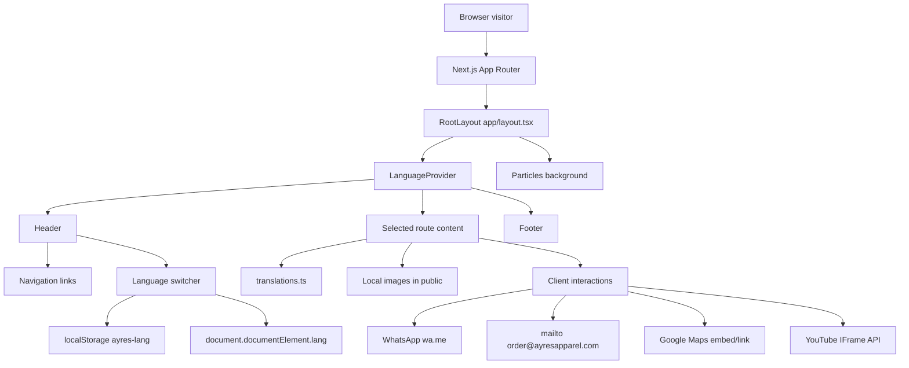
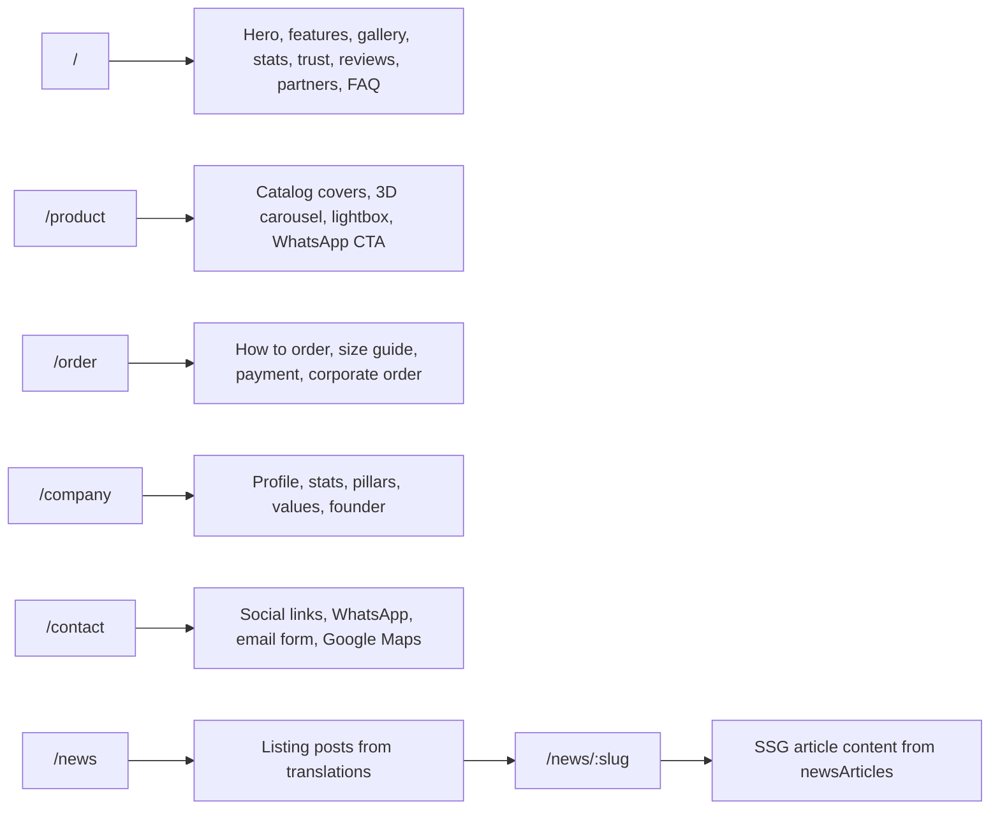
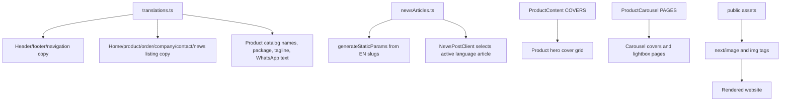
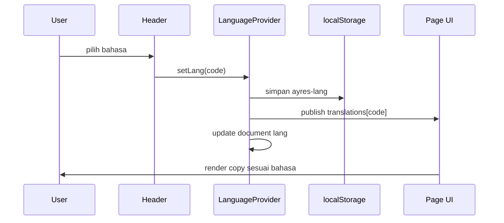
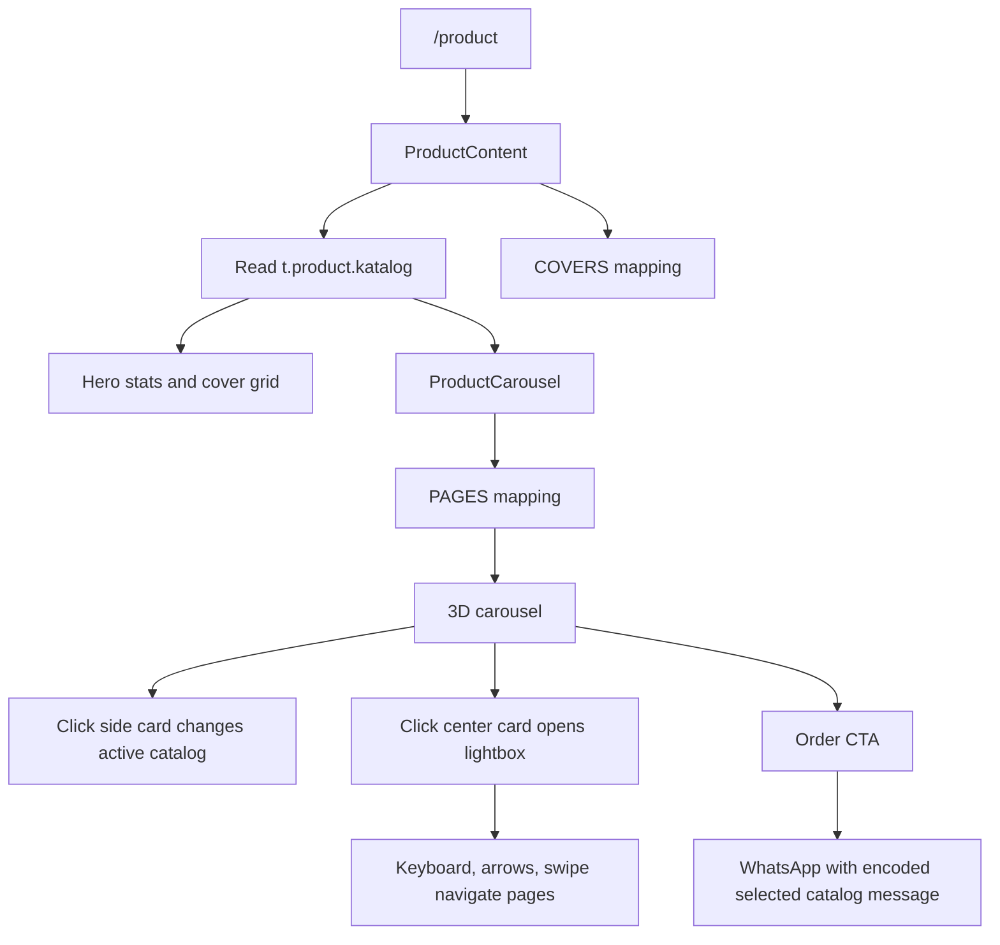
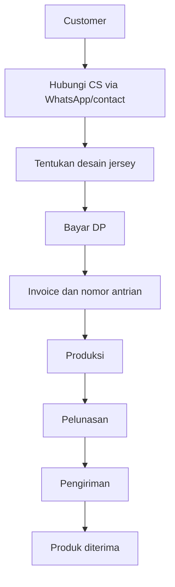
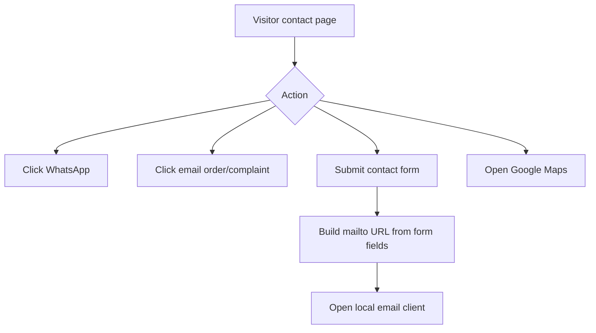

# Ayres Apparel - Official Website

Website resmi Ayres Apparel, produsen jersey custom berbasis di Bantul,
Yogyakarta. Project ini dibangun dengan Next.js App Router, React, TypeScript,
Tailwind CSS v4, serta beberapa komponen animasi Canvas/WebGL untuk pengalaman
visual yang lebih kaya.

Dokumen ini adalah hasil audit flow project pada 2026-07-03. Fokus audit:
arsitektur aplikasi, alur halaman, sumber data, dependensi visual, flow order,
flow katalog, flow berita, dan catatan risiko maintenance.

## Ringkasan Audit

Project ini adalah website statis-interaktif. Tidak ada database, API route,
server action, ataupun backend order internal. Hampir semua konten berasal dari
file lokal:

- Copy multi-bahasa: `lib/i18n/translations.ts`
- Artikel berita lengkap: `lib/i18n/newsArticles.ts`
- Mapping katalog produk: `app/product/ProductContent.tsx` dan
  `app/product/ProductCarousel.tsx`
- Asset gambar: folder `public/`

Flow bisnis utama diarahkan ke channel eksternal:

- Order dan konsultasi via WhatsApp `wa.me`
- Form kontak via `mailto:order@ayresapparel.com`
- Lokasi via Google Maps embed/link
- Social proof via link sosial dan marketplace

## Tech Stack

| Area | Teknologi | Catatan |
| --- | --- | --- |
| Framework | Next.js 16.1.6 | App Router, static rendering, SSG untuk news detail |
| UI | React 19.2.3 | Banyak halaman berupa client component karena i18n client-side |
| Bahasa | TypeScript 5 | `strict: true`, `allowJs: true` |
| Styling | Tailwind CSS v4 | Global CSS di `app/globals.css` |
| Animasi | Motion, GSAP | Text animation, gradient animation, stok komponen interaktif |
| WebGL/Canvas | OGL, Three/R3F | Particles global dan CircularGallery |
| Ikon | SVG inline, lucide tersedia | Sebagian besar ikon masih inline SVG |
| Utility | clsx, tailwind-merge | `lib/utils.ts` |

## Struktur Project

```text
app/
  layout.tsx                  Root layout, metadata global, provider bahasa, header/footer
  page.tsx                    Entry route beranda
  HomeContent.tsx             Client content untuk halaman beranda
  globals.css                 Tailwind import, token warna, base styling
  company/
    page.tsx                  Metadata halaman company
    CompanyContent.tsx        Profil, value, founder
  contact/
    page.tsx                  Metadata halaman contact
    ContactClient.tsx         Kontak, social links, mailto form, map embed
  news/
    page.tsx                  Metadata halaman news
    NewsContent.tsx           Listing berita dari translation
    [slug]/
      page.tsx                generateStaticParams + metadata detail berita
      NewsPostClient.tsx      Render artikel sesuai bahasa aktif
  order/
    page.tsx                  Metadata halaman order
    OrderContent.tsx          Flow order, size chart, payment, corporate order
  product/
    page.tsx                  Metadata halaman product
    ProductContent.tsx        Hero katalog, cover grid, CTA
    ProductCarousel.tsx       3D carousel, thumbnail, lightbox, CTA WhatsApp

components/
  Header.tsx                  Navigasi desktop/mobile + language switcher
  Footer.tsx                  Footer, sosial, marketplace, kontak
  Particles.tsx               Background WebGL global di layout
  CircularGallery.tsx         Gallery WebGL untuk foto jersey customer
  DecryptedText.tsx           Animasi angka/statistik
  GlareHover.tsx              Efek glare untuk kartu jersey
  GradientText.tsx            Animated gradient text
  FeaturesStrip.tsx           Feature cards beranda
  TrustSection.tsx            Tab masalah/solusi trust
  ReviewSlider.tsx            Slider review customer
  YoutubePlayer.tsx           YouTube IFrame API dengan thumbnail custom
  BrandPartners.tsx           Marquee logo partner
  FAQ.tsx                     Accordion FAQ
  Antigravity.tsx             Stok/legacy, tidak dipakai route aktif
  DotGrid.tsx                 Stok/legacy, tidak dipakai route aktif
  ElectricBorder.tsx          Stok/legacy, tidak dipakai route aktif
  GooeyNav.tsx                Stok/legacy, tidak dipakai route aktif
  InstagramEmbed.tsx          Stok/legacy, tidak dipakai route aktif
  ParticleCanvas.tsx          Stok/legacy, tidak dipakai route aktif
  GlareHover.jsx              Duplikat JS legacy dari GlareHover TSX

lib/
  i18n/
    LanguageContext.tsx       Provider bahasa, localStorage, document lang
    translations.ts           Copy UI EN/ID/ZH
    newsArticles.ts           Konten HTML artikel EN/ID/ZH
    index.ts                  Barrel export
  utils.ts                    Helper `cn()`

public/
  gambar/                     Logo, hero images, review, client logos, visual umum
  logo_partner/               Logo partner untuk marquee
  katalogv2/                  Cover dan halaman katalog produk
  JERSEY CUSTOMER/            Foto jersey customer untuk gallery
  Size Chart/                 Gambar size chart
  uploads/                    Asset hasil migrasi WordPress/Elementor
```

## Diagram Arsitektur Runtime



## Diagram Flow Halaman



## Diagram Flow Data Konten



## Flow Request dan Rendering

1. Visitor membuka route.
2. Next.js App Router memilih file `app/**/page.tsx`.
3. `app/layout.tsx` selalu membungkus route dengan:
   - font Google `Raleway` dan `Heebo`
   - `LanguageProvider`
   - background `Particles`
   - `Header`
   - `<main>{children}</main>`
   - `Footer`
4. Page server component hanya memberi metadata dan mengembalikan client content.
5. Client content memanggil `useTranslation()` atau `useLanguage()`.
6. Bahasa default adalah `en`, lalu provider membaca `localStorage` key
   `ayres-lang` setelah mount.
7. Interaksi order/contact mengarah ke WhatsApp, email client, maps, atau
   external social/marketplace.

Konsekuensi: konten awal yang diprerender adalah bahasa default `en`; setelah
hydration, bahasa bisa berubah ke pilihan tersimpan pengguna.

## Flow Bahasa / i18n

Bahasa yang tersedia:

| Kode | Label |
| --- | --- |
| `en` | English |
| `id` | Bahasa Indonesia |
| `zh` | Chinese |

Alur:



Catatan audit:

- `LanguageProvider` melakukan `setState` dari `useEffect` setelah membaca
  `localStorage`; lint React baru menandai pola ini sebagai warning/error.
- Metadata route saat ini hardcoded English di file `page.tsx`; belum mengikuti
  bahasa aktif karena i18n bersifat client-side.
- Beberapa teks di repository tampak mengalami encoding mojibake saat dibaca di
  terminal, terutama simbol panah, emoji, tanda dash, dan copy Mandarin.

## Flow Beranda

Route: `/`

Komponen utama: `app/HomeContent.tsx`

Alur section:

1. Hero: headline, CTA WhatsApp, CTA ke `#gallery`, social proof, showcase jersey.
2. `FeaturesStrip`: harga awal, teknologi pattern, no MOQ, design freedom.
3. Who We Are + `CircularGallery`: galeri customer jersey berbasis OGL/WebGL.
4. Stats: angka animasi menggunakan `DecryptedText`.
5. `TrustSection`: tab masalah kualitas, pengiriman, pricing, service.
6. Testimonials: `YoutubePlayer` + `ReviewSlider`.
7. `BrandPartners`: ticker logo partner.
8. `FAQ`: accordion FAQ.

Sumber data:

- Copy: `translations.ts`
- Foto jersey: `public/JERSEY CUSTOMER/`
- Logo: `public/gambar/new logo.png`
- Partner: `public/logo_partner/`

## Flow Product / Katalog

Route: `/product`

Komponen utama:

- `ProductContent.tsx`
- `ProductCarousel.tsx`

Flow:



Catalog yang tersedia:

| ID | Nama | Package | Jumlah pola di teks | Asset utama |
| --- | --- | --- | --- | --- |
| `adi-vira` | Adi Vira | Classic | 3 | `public/katalogv2/katalog classic Adi Vira/` |
| `cakra-vega` | Cakra Vega | Classic | 6 | `public/katalogv2/katalog classic Cakra Vega/` |
| `bima-sena` | Bima Sena | Pro | 6 | `public/katalogv2/katalog pro Bima Sena/` |
| `garuda-vastra` | Garuda Vastra | Pro | 6 | `public/katalogv2/katalog pro Garuda Vastra/` |

Catatan maintenance penting:

- Menambah katalog baru harus memperbarui minimal tiga tempat:
  `translations.ts` pada `product.katalog`, `COVERS` di `ProductContent.tsx`,
  dan `PAGES` di `ProductCarousel.tsx`.
- Nilai `Total Patterns` di `translations.ts` harus sinkron dengan jumlah pola.
  Saat audit, copy menyebut `21`, sedangkan halaman mapping yang tampak aktif
  berisi 3 + 6 + 4 + 4 halaman detail.
- Lightbox memakai `` biasa untuk ukuran fleksibel dan thumbnail memakai
  `next/image`.

## Flow Order

Route: `/order`

Komponen utama: `OrderContent.tsx`

Flow bisnis order yang didokumentasikan di UI:



Section:

- Hero dengan starting price Rp 70.000
- Benefit: no minimum order, same-day production, deadline guarantee,
  professional designer
- 8 langkah order
- Size guide dari `public/Size Chart/1.png` dan `public/Size Chart/2.png`
- Payment info BCA
- Corporate order untuk volume besar

Catatan audit:

- Nomor rekening di UI adalah konten statis. Pastikan angka tersebut memang data
  produksi sebelum deploy publik.
- Tidak ada validasi pembayaran atau invoice backend di project ini.

## Flow Company

Route: `/company`

Komponen utama: `CompanyContent.tsx`

Section:

- Hero profil Ayres Apparel
- Statistik menggunakan `DecryptedText`
- Who We Are
- Pillars: deadline, pattern lab, no minimum order, affordable price
- Values
- Founder profile dan link sosial founder

Sumber asset utama:

- Logo: `public/gambar/new logo.png`
- Founder photo: `public/ceo/Profile Photo - Mas Arya Rahadhyan.jpg.jpeg`

## Flow Contact

Route: `/contact`

Komponen utama: `ContactClient.tsx`

Flow:



Catatan audit:

- Form tidak mengirim data ke server. Submit hanya membuat `mailto:` dengan
  subject dan body dari field form.
- Jika device user tidak punya email client, submit bisa terasa tidak berhasil.
- Map menggunakan Google Maps embed langsung di iframe.

## Flow News

Routes:

- `/news`
- `/news/[slug]`

Flow listing:

1. `NewsContent.tsx` membaca `t.news.posts`.
2. Setiap post menautkan ke `/news/{slug}`.

Flow detail:

1. `app/news/[slug]/page.tsx` mengambil static params dari
   `Object.keys(newsArticles.en)`.
2. Build menghasilkan halaman statis untuk slug English.
3. `NewsPostClient.tsx` membaca bahasa aktif.
4. Konten artikel dipilih dari `newsArticles[lang][slug]`, fallback ke English.
5. HTML artikel dirender dengan `dangerouslySetInnerHTML`.

Catatan audit:

- `dangerouslySetInnerHTML` masih aman selama konten artikel hanya berasal dari
  file lokal yang dipercaya.
- Jika nanti artikel berasal dari CMS/user input, wajib sanitasi HTML.
- Slug baru harus ada di `newsArticles.en`, karena `generateStaticParams`
  memakai daftar slug English sebagai sumber utama.

## Asset dan Media

Folder penting:

| Folder | Fungsi |
| --- | --- |
| `public/gambar/` | Logo, hero, review, sponsor, visual umum |
| `public/logo_partner/` | Logo partner untuk marquee |
| `public/JERSEY CUSTOMER/` | Gallery customer di beranda |
| `public/katalogv2/` | Cover dan halaman katalog produk aktif |
| `public/katalog/` | Katalog lama/pendukung |
| `public/Size Chart/` | Size chart order |
| `public/uploads/` | Asset migrasi WordPress/Elementor, sangat besar dan sebagian tidak aktif |

Next image config hanya mengizinkan remote image dari:

```text
https://ayresapparel.com/wp-content/uploads/**
```

Namun route aktif mayoritas memakai asset lokal dari `public/`.

## External Integration

| Integrasi | Lokasi | Perilaku |
| --- | --- | --- |
| WhatsApp | Home, Product, Order, Contact, Footer | Link `https://wa.me/...` |
| Email | Contact, Footer | `mailto:` |
| Google Maps | Contact | iframe embed + link maps |
| YouTube | Home testimonial | IFrame API dimuat saat tombol play diklik |
| Social links | Contact, Footer, Company founder | External links |
| Marketplace | Footer | Shopee dan Tokopedia |

Tidak ada token API rahasia di project saat audit.

## Komponen Aktif vs Legacy

Komponen aktif pada route saat ini:

- `Header`
- `Footer`
- `Particles`
- `GlareHover`
- `GradientText`
- `CircularGallery`
- `FeaturesStrip`
- `TrustSection`
- `ReviewSlider`
- `YoutubePlayer`
- `FAQ`
- `BrandPartners`
- `DecryptedText`

Komponen stok/legacy yang ada tetapi tidak dipakai route aktif:

- `Antigravity`
- `DotGrid`
- `ElectricBorder`
- `GooeyNav`
- `InstagramEmbed`
- `ParticleCanvas`
- `GlareHover.jsx`

Catatan audit: komponen legacy ikut dilint oleh `npm run lint`, sehingga error
di file tidak aktif tetap membuat lint project gagal.

## Cara Menjalankan

```bash
npm install
npm run dev
```

Buka:

```text
http://localhost:3000
```

Command lain:

```bash
npm run build
npm start
npm run lint
```

## Cara Maintenance Konten

### Mengubah copy halaman

Edit `lib/i18n/translations.ts`.

Pastikan perubahan dilakukan untuk semua bahasa yang ingin didukung:

- `en`
- `id`
- `zh`

### Menambah artikel berita

1. Tambahkan ringkasan post ke `translations.ts` pada `news.posts`.
2. Tambahkan konten lengkap ke `newsArticles.ts` untuk minimal `en`.
3. Jika ingin multi-bahasa, tambahkan slug yang sama pada `id` dan `zh`.
4. Jalankan `npm run build` untuk memastikan slug masuk static generation.

### Menambah katalog produk

1. Tambahkan entry di `translations.ts` pada `product.katalog`.
2. Tambahkan cover di `COVERS` dalam `ProductContent.tsx`.
3. Tambahkan cover dan halaman detail di `PAGES` dalam `ProductCarousel.tsx`.
4. Simpan gambar di `public/katalogv2/...`.
5. Sesuaikan angka statistik katalog/pola di `translations.ts`.
6. Jalankan `npm run build`.

### Mengubah flow order

Edit:

- Copy dan langkah order di `translations.ts` pada object `order`
- Visual/section order di `app/order/OrderContent.tsx`
- CTA WhatsApp hardcoded di `OrderContent.tsx` bila nomor atau template pesan berubah

### Mengubah kontak

Edit:

- Social links dan form behavior di `app/contact/ContactClient.tsx`
- Copy kontak di `translations.ts`
- Footer contact/social links di `components/Footer.tsx`

## Temuan Audit Teknis

| Severity | Area | Temuan | Dampak | Rekomendasi |
| --- | --- | --- | --- | --- |
| High | Lint | `npm run lint` gagal 32 error, 3 warning | CI berbasis lint akan gagal | Rapikan komponen legacy atau exclude jika benar-benar tidak dipakai |
| High | Encoding | Banyak copy/comment terbaca mojibake | Teks UI tertentu bisa tampil rusak | Normalisasi file ke UTF-8 dan cek render browser |
| Medium | i18n | Metadata route tidak mengikuti bahasa aktif | SEO multi-bahasa terbatas | Pertimbangkan routing per locale atau server-side locale |
| Medium | News HTML | Artikel memakai `dangerouslySetInnerHTML` | Aman untuk file lokal, berisiko jika sumber eksternal | Sanitasi bila pindah ke CMS |
| Medium | Product data | Mapping katalog tersebar di beberapa file | Mudah tidak sinkron | Satukan katalog ke satu file data terstruktur |
| Medium | Contact form | Submit hanya `mailto:` | Bergantung email client user | Tambahkan API route/form service bila butuh reliabilitas |
| Low | Asset | `public/uploads` sangat besar dan banyak asset migrasi | Repo/deploy lebih berat | Audit asset aktif dan arsipkan yang tidak dipakai |
| Low | Duplicate | `GlareHover.jsx` duplikat dari TSX | Kebingungan maintenance | Hapus setelah dipastikan tidak dipakai |

## Hasil Verifikasi

Dijalankan pada 2026-07-03:

```text
npm run build
```

Status: berhasil.

Build output route:

```text
/                         Static
/_not-found                Static
/company                   Static
/contact                   Static
/icon.png                  Static
/news                      Static
/news/[slug]               SSG
/order                     Static
/product                   Static
```

Dijalankan:

```text
npm run lint
```

Status: gagal.

Ringkasan error lint:

- `components/Antigravity.tsx`: `Math.random()` dipanggil saat render,
  beberapa `prefer-const`, unused eslint-disable.
- `components/CircularGallery.tsx`: beberapa `any`.
- `components/DotGrid.tsx`: beberapa `any`, `setState` sinkron di effect.
- `components/GooeyNav.tsx`: `Math.random()` dipanggil saat render.
- `components/InstagramEmbed.tsx`: beberapa `any`.
- `lib/i18n/LanguageContext.tsx`: `setState` sinkron di effect setelah
  membaca `localStorage`.
- `components/GradientText.tsx`: dependency hook `progress` belum masuk array.

## Prioritas Perbaikan Berikutnya

1. Normalisasi encoding file source ke UTF-8 agar teks dan simbol tidak rusak.
2. Putuskan komponen legacy: hapus, exclude lint, atau perbaiki.
3. Satukan data katalog ke satu module, misalnya `lib/catalog.ts`.
4. Jika order/contact perlu tracking, ganti `mailto:` dengan API route atau form
   provider.
5. Tambahkan strategi locale SEO jika website memang butuh indexing EN/ID/ZH.
6. Audit asset `public/uploads` untuk mengurangi ukuran repository dan deployment.
