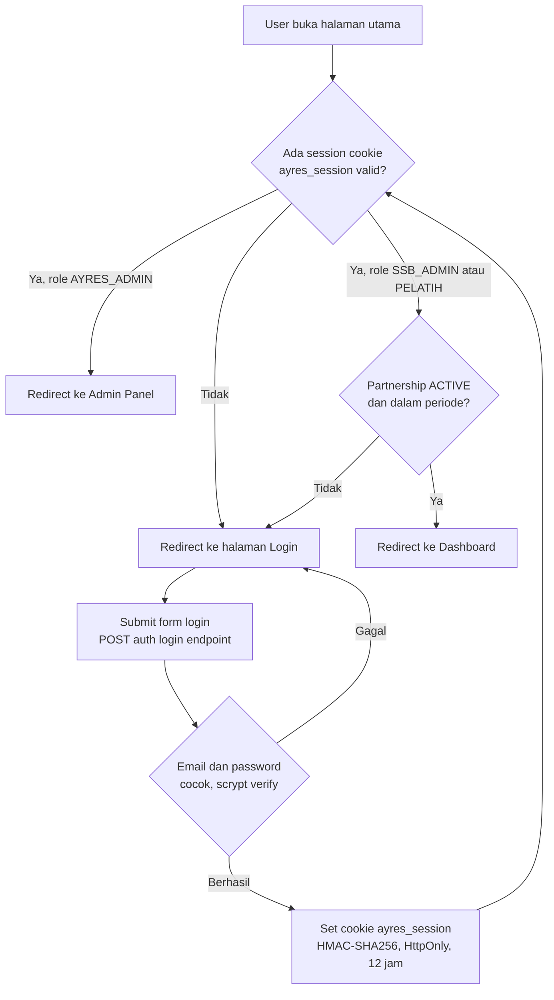
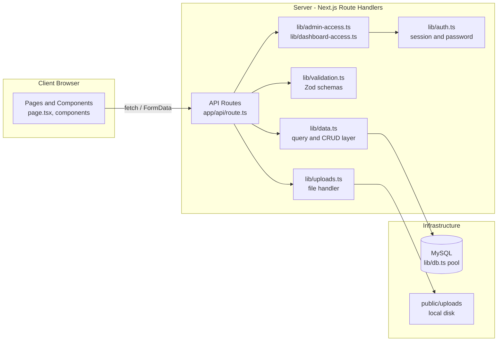
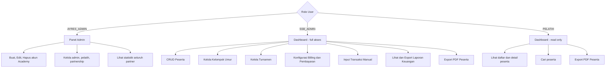
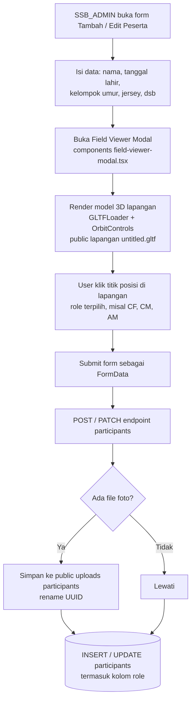
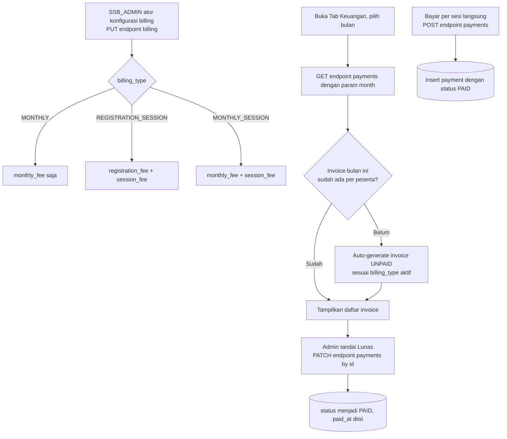
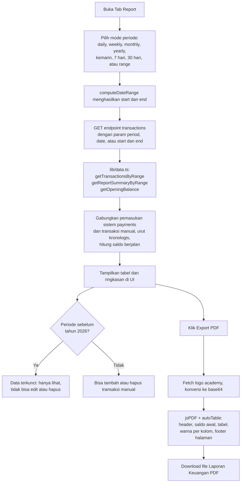
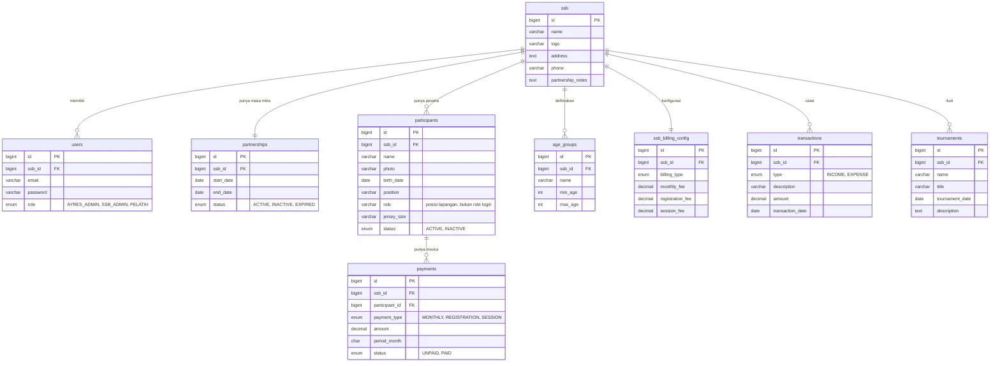

# Ayres Academy Dashboard

Dashboard digital untuk manajemen **Sekolah Sepak Bola (SSB / Academy)** yang bermitra dengan **Ayres Apparel**. Aplikasi memusatkan pengelolaan data peserta, keuangan, billing, dan turnamen dalam satu sistem multi-role, dengan tema UI "dark sporty".

> Catatan penamaan: sejak redesign UI, seluruh label yang tampil ke pengguna memakai istilah **"Academy"**, namun secara internal (kode, tabel database, endpoint API) masih memakai istilah **`ssb`** apa adanya (`ssb_id`, `/api/ssb/*`, tabel `ssb`, dst). Ini murni rebranding tampilan, bukan migrasi data — jangan bingung saat membaca kode.

## Daftar Isi

- [Tech Stack](#tech-stack)
- [Fitur Utama](#fitur-utama)
- [Arsitektur & Alur Sistem](#arsitektur--alur-sistem)
  - [Alur Autentikasi & Routing](#1-alur-autentikasi--routing)
  - [Struktur Layer Aplikasi](#2-struktur-layer-aplikasi)
  - [Alur Role & Hak Akses](#3-alur-role--hak-akses)
  - [Alur Data Peserta & Role Posisi 3D](#4-alur-data-peserta--role-posisi-3d)
  - [Alur Billing & Pembayaran](#5-alur-billing--pembayaran)
  - [Alur Laporan Keuangan & Export PDF](#6-alur-laporan-keuangan--export-pdf)
  - [Relasi Database (ERD)](#7-relasi-database-erd)
- [Prasyarat](#prasyarat)
- [Instalasi](#instalasi)
- [Scripts](#scripts)
- [Struktur Project](#struktur-project)
- [Sistem Role & Hak Akses](#sistem-role--hak-akses)
- [Database](#database)
- [API Endpoints](#api-endpoints)
- [Autentikasi & Keamanan](#autentikasi--keamanan)
- [Upload File](#upload-file)
- [Export PDF](#export-pdf)
- [Tema UI (Dark Sporty)](#tema-ui-dark-sporty)
- [Konvensi Backup Database](#konvensi-backup-database)
- [Known Issues / Technical Debt](#known-issues--technical-debt)

## Tech Stack

| Layer | Teknologi |
|-------|-----------|
| Framework | [Next.js 16](https://nextjs.org) (App Router, Turbopack) |
| Frontend | React 19, TypeScript 5 |
| Styling | Tailwind CSS 4 + custom CSS design system (`app/globals.css`) |
| Database | MySQL 8+ (`mysql2/promise`, raw SQL — tanpa ORM) |
| Validasi | Zod 4 |
| PDF Export | jsPDF 4 + jspdf-autotable 5 |
| Animasi / 3D | Motion (Framer Motion), Three.js, three-globe, Cobe (3D Globe), GLTFLoader (model lapangan 3D) |
| Auth | Custom (session HMAC-SHA256 + scrypt password hashing) — tanpa library pihak ketiga |

Tidak ada integrasi payment gateway, email, atau cloud storage — upload file disimpan langsung di disk lokal (`public/uploads/`).

## Fitur Utama

- **Multi-Role Access Control** — 3 role: `AYRES_ADMIN` (admin pusat), `SSB_ADMIN` (admin academy), `PELATIH` (coach, read-only)
- **Manajemen Peserta** — CRUD data pemain lengkap dengan upload foto
- **Role/Posisi Pemain via Lapangan 3D** — pemilihan posisi visual di atas model lapangan 3D (Three.js + GLTF)
- **Kelompok Umur** — klasifikasi custom per academy berdasarkan rentang umur
- **Billing & Pembayaran** — 3 tipe billing, auto-generate invoice bulanan
- **Laporan Keuangan Fleksibel** — filter periode: harian, mingguan, bulanan, tahunan, kemarin, 7 hari, 30 hari, atau rentang custom
- **Turnamen** — kelola data turnamen academy
- **Export PDF** — laporan keuangan (multi-periode) dan lembar data peserta
- **Partnership Management** — admin pusat kelola akun academy dan masa kemitraan (dengan auto-revoke akses saat partnership berakhir)
- **Dark Sporty Theme** — desain gelap bertema olahraga (font Bebas Neue + Inter, aksen merah, efek stadium/noise)

## Arsitektur & Alur Sistem

### 1. Alur Autentikasi & Routing



- Root page (`app/page.tsx`) memutuskan redirect berdasarkan sesi aktif.
- `lib/admin-access.ts` → `getAuthorizedAdminSession()` menjaga akses `/admin`.
- `lib/dashboard-access.ts` → `getAuthorizedDashboardSession()` menjaga akses `/dashboard`, sekaligus memverifikasi status `partnerships.status = 'ACTIVE'` dan tanggal berjalan masih di antara `start_date`–`end_date`. Jika partnership kedaluwarsa, akses otomatis ditolak meski sesi login masih valid.

### 2. Struktur Layer Aplikasi



Tidak ada ORM: `lib/data.ts` berisi seluruh query SQL terparameterisasi dan fungsi CRUD per entitas (participants, payments, transactions, dst), dipanggil langsung oleh route handler.

### 3. Alur Role & Hak Akses



### 4. Alur Data Peserta & Role Posisi 3D



> Catatan: kolom `role` pada tabel `participants` adalah **posisi bermain di lapangan** (dipilih via model 3D), berbeda dari `role` pada tabel `users` yang merupakan **role login** (AYRES_ADMIN/SSB_ADMIN/PELATIH). Penamaan sama tapi konsep berbeda — jangan tertukar saat membaca kode.

### 5. Alur Billing & Pembayaran



### 6. Alur Laporan Keuangan & Export PDF



### 7. Relasi Database (ERD)



## Prasyarat

- **Node.js** >= 18
- **MySQL** >= 8.0
- **npm** (atau pnpm/yarn)

## Instalasi

### 1. Clone & Install Dependencies

```bash
git clone <repo-url>
cd web_ssb
npm install
```

### 2. Konfigurasi Environment

Salin file `.env.example` ke `.env.local` lalu sesuaikan:

```bash
cp .env.example .env.local
```

```env
DB_HOST=127.0.0.1
DB_PORT=3306
DB_USER=root
DB_PASSWORD=
DB_NAME=ayres_ssb_dashboard
AUTH_SECRET=ganti-dengan-random-secret
```

> `AUTH_SECRET` digunakan untuk signing session token (HMAC-SHA256). Gunakan string acak yang panjang.

### 3. Setup Database

Jalankan schema utama, lalu migration secara berurutan:

```sql
-- 1. Buat database
CREATE DATABASE ayres_ssb_dashboard;
USE ayres_ssb_dashboard;

-- 2. Jalankan schema utama
SOURCE database/schema.sql;

-- 3. Jalankan migration (urut)
SOURCE database/migrations/2026-03-09-add-ssb-partnership-notes.sql;
SOURCE database/migrations/2026-03-28-add-age-groups-and-photo.sql;
SOURCE database/migrations/2026-03-28-add-billing-and-payments.sql;
SOURCE database/migrations/2026-03-28-add-transactions.sql;
SOURCE database/migrations/2026-03-28-rename-deposit-to-registration.sql;

-- 4. (Opsional) Seed data awal
SOURCE database/seed.sql;
```

> ⚠️ Lihat [Known Issues](#known-issues--technical-debt) — tabel `tournaments` dan nilai enum `PELATIH` pada `users.role` **belum** memiliki file migration resmi di `database/migrations/`. Jika setup dari nol, tambahkan manual (lihat detail di bagian tersebut) sebelum menjalankan fitur turnamen atau login sebagai coach.

### 4. Jalankan Development Server

```bash
npm run dev
```

Buka [http://localhost:3000](http://localhost:3000) di browser.

## Scripts

| Script | Perintah | Keterangan |
|--------|----------|------------|
| Dev | `npm run dev` | Jalankan development server (Turbopack) |
| Build | `npm run build` | Build untuk production |
| Start | `npm run start` | Jalankan production server |
| Lint | `npm run lint` | Cek linting dengan ESLint |

## Struktur Project

```
web_ssb/
├── app/                              # Next.js App Router
│   ├── layout.tsx                    # Root layout (font Bebas Neue + Inter, metadata)
│   ├── page.tsx                      # Landing — redirect by role & session
│   ├── globals.css                   # Dark sporty design system
│   ├── login/page.tsx                # Halaman login
│   ├── dashboard/page.tsx            # Dashboard SSB Admin & Pelatih
│   ├── admin/page.tsx                # Panel Ayres Admin
│   └── api/                          # API Routes (Route Handlers)
│       ├── auth/
│       │   ├── login/route.ts        # POST — login
│       │   └── logout/route.ts       # POST — logout
│       ├── admin/ssb/
│       │   ├── route.ts              # GET, POST — list & create academy
│       │   └── [id]/route.ts         # PATCH, DELETE — update & delete academy
│       ├── dashboard/summary/
│       │   └── route.ts              # GET — dashboard statistics
│       ├── participants/
│       │   ├── route.ts              # GET, POST — list & create peserta
│       │   └── [id]/route.ts         # PATCH, DELETE — update & delete peserta
│       └── ssb/
│           ├── profile/route.ts      # GET, PATCH — profil academy
│           ├── age-groups/
│           │   ├── route.ts          # GET, POST
│           │   └── [id]/route.ts     # PATCH, DELETE
│           ├── billing/route.ts      # GET, PUT — konfigurasi billing
│           ├── payments/
│           │   ├── route.ts          # GET, POST — list & create pembayaran
│           │   └── [id]/route.ts     # PATCH — tandai lunas
│           ├── tournaments/
│           │   ├── route.ts          # GET, POST
│           │   └── [id]/route.ts     # PATCH, DELETE
│           └── transactions/
│               ├── route.ts          # GET, POST — transaksi keuangan (multi-periode)
│               └── [id]/route.ts     # DELETE
├── components/
│   ├── dashboard-shell.tsx           # Shell utama dashboard (tabs, peserta, profil, PDF peserta)
│   ├── finance-manager.tsx           # Tab Keuangan (billing, pembayaran)
│   ├── report-manager.tsx            # Tab Report (laporan keuangan multi-periode, export PDF)
│   ├── tournament-manager.tsx        # Tab Turnamen
│   ├── field-viewer-modal.tsx        # Modal pemilihan posisi via lapangan 3D
│   ├── admin-ssb-manager.tsx         # Panel kelola akun academy (Ayres Admin)
│   ├── admin-stats.tsx               # Kartu statistik admin
│   ├── admin-actions.tsx             # Tombol aksi admin (logout)
│   ├── login-form.tsx                # Form login
│   ├── login-preloader.tsx           # Preloader saat login
│   ├── particle-background.tsx       # Animasi partikel canvas
│   ├── dashboard-illustration.tsx    # Ilustrasi SVG halaman login
│   ├── border-glow.tsx               # Efek glow dekoratif
│   └── ui/globe.tsx                  # 3D Globe (Three.js + Cobe)
├── lib/
│   ├── auth.ts                       # Autentikasi (session, hashing, cookie)
│   ├── data.ts                       # Data layer (query, types, CRUD functions)
│   ├── db.ts                         # MySQL connection pool
│   ├── validation.ts                 # Zod schemas
│   ├── uploads.ts                    # Upload handler (logo, foto peserta)
│   ├── admin-access.ts               # Guard akses Ayres Admin
│   └── dashboard-access.ts           # Guard akses SSB Admin & Pelatih (+ cek partnership aktif)
├── database/
│   ├── schema.sql                    # Schema database utama
│   ├── seed.sql                      # Data seed awal
│   └── migrations/                   # File migrasi database (kronologis)
├── backup_db/
│   └── backup.sql                    # Snapshot manual database dev (lihat Konvensi Backup Database)
├── public/
│   ├── uploads/                      # File upload (logo academy, foto peserta)
│   │   ├── ssb/
│   │   └── participants/
│   └── lapangan/untitled.gltf        # Model 3D lapangan untuk pemilihan posisi
├── .env.example                      # Template environment variables
├── next.config.ts
├── tsconfig.json
└── package.json
```

## Sistem Role & Hak Akses

### AYRES_ADMIN (Admin Pusat)

Mengelola seluruh akun academy partner dari panel `/admin`.

| Fitur | Akses |
|-------|-------|
| Buat akun academy (admin + pelatih + partnership) | Ya |
| Edit data academy, akun admin, akun pelatih | Ya |
| Atur tanggal & status partnership | Ya |
| Hapus akun academy (cascade semua data) | Ya |
| Lihat statistik (total, aktif, perlu tindakan) | Ya |

### SSB_ADMIN (Admin Academy)

Mengelola operasional academy dari dashboard `/dashboard`.

| Fitur | Akses |
|-------|-------|
| Edit profil academy (nama, logo, alamat, telepon) | Ya |
| CRUD data peserta (+ upload foto, + pilih posisi via lapangan 3D) | Ya |
| CRUD kelompok umur | Ya |
| CRUD turnamen | Ya |
| Konfigurasi billing (tipe & tarif) | Ya |
| Kelola pembayaran (tandai lunas, buat session payment) | Ya |
| Input transaksi manual (pemasukan/pengeluaran) | Ya |
| Lihat laporan keuangan (multi-periode: harian/mingguan/bulanan/tahunan/rentang) | Ya |
| Export PDF laporan keuangan | Ya |
| Export PDF data peserta | Ya |

### PELATIH (Coach)

Akses read-only ke data peserta dari dashboard `/dashboard`.

| Fitur | Akses |
|-------|-------|
| Lihat daftar peserta (tabel + pencarian) | Ya |
| Lihat detail peserta (modal) | Ya |
| Export PDF data peserta | Ya |
| Edit/hapus peserta | Tidak |
| Akses tab Keuangan, Report, Turnamen | Tidak |

Untuk kedua role `SSB_ADMIN` dan `PELATIH`, akses dashboard otomatis dicabut jika partnership academy berstatus tidak `ACTIVE` atau tanggal berjalan berada di luar rentang `start_date`–`end_date`.

## Database

### Tabel Utama

| Tabel | Keterangan |
|-------|------------|
| `ssb` | Data academy (nama, logo, alamat, telepon) |
| `users` | Akun pengguna (email, password, role, ssb_id) |
| `partnerships` | Data kemitraan academy (tanggal mulai/akhir, status) |
| `participants` | Data peserta/pemain (termasuk kolom `role` = posisi lapangan) |
| `age_groups` | Klasifikasi kelompok umur per academy |
| `ssb_billing_config` | Konfigurasi billing per academy |
| `payments` | Record pembayaran (invoice) |
| `transactions` | Transaksi keuangan manual |
| `tournaments` | Data turnamen (⚠️ lihat [Known Issues](#known-issues--technical-debt)) |

Diagram relasi lengkap: lihat [Relasi Database (ERD)](#7-relasi-database-erd) di atas.

### Tipe Billing

| Tipe | Keterangan | Fee yang Digunakan |
|------|------------|--------------------|
| `MONTHLY` | Iuran bulanan saja | `monthly_fee` |
| `REGISTRATION_SESSION` | Pendaftaran + per sesi | `registration_fee`, `session_fee` |
| `MONTHLY_SESSION` | Bulanan + per sesi | `monthly_fee`, `session_fee` |

## API Endpoints

### Auth

| Method | Endpoint | Keterangan |
|--------|----------|------------|
| POST | `/api/auth/login` | Login, return session cookie |
| POST | `/api/auth/logout` | Logout, hapus session |

### Admin (AYRES_ADMIN)

| Method | Endpoint | Keterangan |
|--------|----------|------------|
| GET | `/api/admin/ssb` | List semua academy dengan partnership & coach |
| POST | `/api/admin/ssb` | Buat academy baru (academy + admin + coach + partnership) |
| PATCH | `/api/admin/ssb/:id` | Update data academy |
| DELETE | `/api/admin/ssb/:id` | Hapus academy dan seluruh data terkait |

### Dashboard

| Method | Endpoint | Keterangan |
|--------|----------|------------|
| GET | `/api/dashboard/summary` | Statistik dashboard (jumlah peserta, partnership) |

### Peserta

| Method | Endpoint | Keterangan |
|--------|----------|------------|
| GET | `/api/participants` | List peserta per academy |
| POST | `/api/participants` | Tambah peserta (FormData, support foto + role posisi) |
| PATCH | `/api/participants/:id` | Update peserta |
| DELETE | `/api/participants/:id` | Hapus peserta |

### SSB / Academy Profile

| Method | Endpoint | Keterangan |
|--------|----------|------------|
| GET | `/api/ssb/profile` | Ambil profil academy |
| PATCH | `/api/ssb/profile` | Update profil academy (FormData, support logo) |

### Kelompok Umur

| Method | Endpoint | Keterangan |
|--------|----------|------------|
| GET | `/api/ssb/age-groups` | List kelompok umur |
| POST | `/api/ssb/age-groups` | Buat kelompok umur baru |
| PATCH | `/api/ssb/age-groups/:id` | Update kelompok umur |
| DELETE | `/api/ssb/age-groups/:id` | Hapus kelompok umur |

### Billing & Pembayaran

| Method | Endpoint | Keterangan |
|--------|----------|------------|
| GET | `/api/ssb/billing` | Ambil konfigurasi billing |
| PUT | `/api/ssb/billing` | Simpan/update konfigurasi billing |
| GET | `/api/ssb/payments?month=YYYY-MM` | List pembayaran bulan tertentu (auto-generate invoice) |
| POST | `/api/ssb/payments` | Buat session payment (langsung lunas) |
| PATCH | `/api/ssb/payments/:id` | Tandai pembayaran sebagai lunas |

### Turnamen

| Method | Endpoint | Keterangan |
|--------|----------|------------|
| GET | `/api/ssb/tournaments` | List turnamen |
| POST | `/api/ssb/tournaments` | Buat turnamen baru |
| PATCH | `/api/ssb/tournaments/:id` | Update turnamen |
| DELETE | `/api/ssb/tournaments/:id` | Hapus turnamen |

### Transaksi & Laporan Keuangan

| Method | Endpoint | Keterangan |
|--------|----------|------------|
| GET | `/api/ssb/transactions?period=daily\|weekly\|monthly\|yearly&date=...` | List transaksi + ringkasan + saldo awal untuk satu periode |
| GET | `/api/ssb/transactions?period=range&start=YYYY-MM-DD&end=YYYY-MM-DD` | List transaksi untuk rentang tanggal custom |
| POST | `/api/ssb/transactions` | Buat transaksi manual (pemasukan/pengeluaran) |
| DELETE | `/api/ssb/transactions/:id` | Hapus transaksi manual |

> Parameter `period` mendukung `daily` (butuh `date=YYYY-MM-DD`), `weekly` (`date` = tanggal apa saja dalam minggu tsb, dihitung Senin–Minggu), `monthly` (`date=YYYY-MM`), `yearly` (`date=YYYY`), dan `range` (butuh `start` & `end`). Mode tambahan seperti "kemarin", "7 hari", "30 hari" di UI (`report-manager.tsx`) dikonversi ke `period=range` sebelum memanggil API.

## Autentikasi & Keamanan

- **Session**: Custom token (HMAC-SHA256) disimpan di HTTP-only cookie (`ayres_session`, 12 jam, `SameSite=lax`, `secure` di production)
- **Password**: Hashing dengan scrypt + salt acak 16 byte, verifikasi timing-safe (`crypto.timingSafeEqual`)
- **Akses Halaman**: Validasi session + role + status partnership aktif di server-side
- **SQL Injection**: Parameterized queries di seluruh data layer (`lib/data.ts`)
- **File Upload**: Validasi tipe (JPG/PNG/WEBP) dan ukuran maks 2 MB
- **CSRF**: SameSite=lax cookie policy

## Upload File

| Jenis | Path | Format | Maks |
|-------|------|--------|------|
| Logo Academy | `public/uploads/ssb/` | JPG, PNG, WEBP | 2 MB |
| Foto Peserta | `public/uploads/participants/` | JPG, PNG, WEBP | 2 MB |

Nama file otomatis di-generate menggunakan UUID.

## Export PDF

### Laporan Keuangan (Tab Report)
- Header: logo academy, nama academy, teks periode laporan (mendukung semua mode periode)
- Saldo awal periode (`getOpeningBalance`)
- Tabel gabungan pemasukan (sistem dari `payments` + transaksi manual) dan pengeluaran, terurut kronologis dengan kolom saldo berjalan
- Kode warna kolom: hijau = pemasukan, merah = pengeluaran, biru = saldo
- Baris total di footer tabel (bold)
- Footer halaman: tanggal cetak, nomor halaman
- Nama file: `Laporan_Keuangan_<NamaAcademy>_<RentangTanggal>.pdf`

### Data Peserta (Modal Detail)
- Header: logo & nama academy
- Detail: nama, status, panggilan, tanggal lahir, umur, kelompok umur, turnamen, posisi, **role (posisi lapangan)**, ukuran jersey, tanggal bergabung, wali, HP wali, alamat, catatan
- Footer: tanggal cetak
- Tersedia untuk role `SSB_ADMIN` maupun `PELATIH`

## Tema UI (Dark Sporty)

- Palet warna didefinisikan sebagai CSS custom properties di `app/globals.css`: background `#0F0F0F`, surface `#1E1E1E`/`#2A2A2A`, teks `#F5F5F5`, aksen merah `#FF3B30` (dan `#B22A22` untuk gradient/hover)
- Font: **Bebas Neue** untuk heading/display (uppercase, italic, tebal), **Inter** untuk body text — dimuat via `next/font/google` di `app/layout.tsx`
- Efek visual: background stadium & noise/grid pattern, racing-stripe, live badge/chip, stat card, custom scrollbar gelap
- Diterapkan konsisten di seluruh halaman: login, dashboard, admin panel, dan semua komponen manajemen (finance, report, tournament, field viewer)
- Seluruh label UI yang sebelumnya "SSB" diganti menjadi "Academy" (mis. "Academy Control Center", "Dashboard Academy Partner") — perubahan ini murni tampilan, tidak menyentuh skema database maupun nama variabel/endpoint internal

## Konvensi Backup Database

`backup_db/backup.sql` adalah **snapshot manual** hasil `mysqldump`/export phpMyAdmin dari database development — bukan fitur backup otomatis di dalam aplikasi. Gunakan sebagai referensi struktur data terkini atau untuk memulihkan data dev secara manual:

```bash
mysql -u root -p ayres_ssb_dashboard < backup_db/backup.sql
```

File dump lain (`*.sql` di root, di luar `database/schema.sql`, `database/seed.sql`, dan `database/migrations/*.sql`) diabaikan oleh git (`.gitignore`) dan bersifat lokal per developer.

## Known Issues / Technical Debt

Beberapa perubahan skema sempat diterapkan langsung ke database development tanpa file migration resmi di `database/migrations/`. Jika melakukan setup database dari nol menggunakan `schema.sql` + migrations yang ada, dua hal berikut **tidak akan otomatis tersedia**:

1. **Tabel `tournaments` belum punya file migration.** Skemanya hanya ada di dump `backup_db/backup.sql`. Untuk membuatnya manual:
   ```sql
   CREATE TABLE tournaments (
     id BIGINT UNSIGNED NOT NULL AUTO_INCREMENT,
     ssb_id BIGINT UNSIGNED NOT NULL,
     name VARCHAR(200) NOT NULL,
     title VARCHAR(200) DEFAULT NULL,
     tournament_date DATE NOT NULL,
     description TEXT DEFAULT NULL,
     created_at TIMESTAMP NOT NULL DEFAULT CURRENT_TIMESTAMP,
     updated_at TIMESTAMP NOT NULL DEFAULT CURRENT_TIMESTAMP ON UPDATE CURRENT_TIMESTAMP,
     PRIMARY KEY (id),
     KEY idx_tournaments_ssb_id (ssb_id),
     CONSTRAINT fk_tournaments_ssb FOREIGN KEY (ssb_id) REFERENCES ssb (id)
       ON UPDATE CASCADE ON DELETE CASCADE
   ) ENGINE=InnoDB DEFAULT CHARSET=utf8mb4 COLLATE=utf8mb4_unicode_ci;
   ```
2. **Role `PELATIH` belum ditambahkan ke enum `users.role`.** `database/schema.sql` masih mendefinisikan `ENUM('AYRES_ADMIN', 'SSB_ADMIN')`. Untuk mengaktifkan role coach:
   ```sql
   ALTER TABLE users MODIFY COLUMN role ENUM('AYRES_ADMIN', 'SSB_ADMIN', 'PELATIH') NOT NULL;
   ```

**Rekomendasi**: buat file migration resmi untuk kedua perubahan di atas (mis. `database/migrations/2026-XX-XX-add-tournaments-and-pelatih-role.sql`) agar `schema.sql` + urutan migration kembali menjadi satu-satunya sumber kebenaran skema database, selaras dengan kondisi produksi saat ini.
